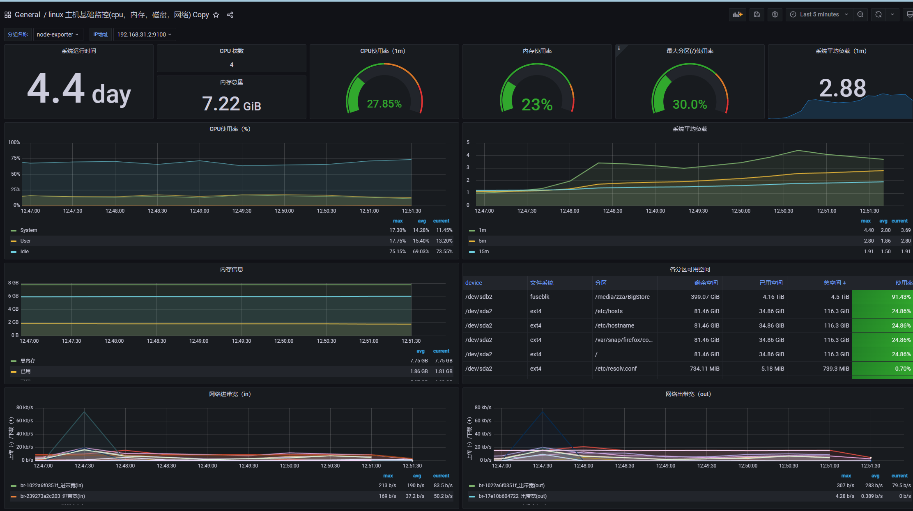

# Grafana Prometheus

- [参考](https://www.cnblogs.com/boci/p/15802939.html)

## windows 进程 监控

- [windows wmi-exporter 进程监控](https://www.cnblogs.com/guoxiangyue/p/11777227.html)
  - 对应的看板 dashboard Id 10467
  - 没有进程数据
    - 服务器管理器找到 `WMI exporter`
      - 添加参数 `--collectors.enabled "[defaults],process,container"`

```text
Grafana Status Map Panel not working, shows "Panel plugin not found: flant-statusmap-panel" #197
```

- 解决方法
  - Open your Grafana instance and go to the Plugins section in the left-hand -nu.
  - Search for "statusmap" in the search bar.
  - Click on the "Install" button for the "statusmap" plugin.
  - Wait for the installation to complete.\

## Grafana + prometheus + node-exporter docker-compose.yml

`vim prometheus/docker-compose.yml`

```yml
version: "3.7"
services:
  node_exporter:
    image: quay.io/prometheus/node-exporter:latest
    container_name: node_exporter
    command:
      - '--path.rootfs=/host'
    user: "1000"
    network_mode: host
    # pid: host
    restart: unless-stopped
    volumes:
      - '/:/host:ro,rslave'
  prometheus:
    image: prom/prometheus:latest
    container_name: "prometheus"
    restart: always
    ports:
      - "9111:9090"
    volumes:
      - "./prometheus.yml:/etc/prometheus/prometheus.yml"
      - "./prometheus_data:/prometheus"
  grafana:
    image: grafana/grafana
    container_name: "grafana"
    ports:
      - "3000:3000"
    restart: always
    volumes:
      - "./grafana_data:/var/lib/grafana"
  process-exporter:
    image: ncabatoff/process-exporter
    command: --procfs /host/proc -config.path /config/process-exporter-config.yml
    privileged: true
    volumes:
      - /proc:/host/proc
      - ./process-exporter-config.yml:/config/process-exporter-config.yml
    ports:
      - "9256:9256"
    restart: always
```

`vim prometheus/prometheus.yml` - 需要根据自己的 ip 进行修改器

```yml
global:
  scrape_interval: 15s # 默认抓取周期
  external_labels:
    monitor: "codelab-monitor"
scrape_configs:
  - job_name: "node-exporter" #服务的名称
    scrape_interval: 5s
    metrics_path: /metrics #获取指标的 url
    static_configs:
      - targets: ["192.168.31.2:9100"] # 这个为监听指定服务服务的 ip 和 port，需要修改为自己的 ip，貌似云服务必须用公网 ip
  - job_name: "process-exporter"
    scrape_interval: 5s
    metrics_path: /metrics
    static_configs:
      - targets: ["192.168.31.2:9256"]
  - job_name: "windows-laptop"
    scrape_interval: 5s
    metrics_path: /metrics
    static_configs:
      - targets: ["192.168.31.3:9182"]
  - job_name: "other-node-192.168.31.5-node-exporter"
    scrape_interval: 5s
    metrics_path: /metrics
    static_configs:
      - targets: ["192.168.31.5"]
```

## node-exporter linux 服务器状态监控

- 访问 http://ip:9100/metrics 查看相关指标是否有出现

- node-exporter 找不到挂载硬盘问题
  - 权限问题
    - user: "1000"
  - https://github.com/prometheus/node_exporter/issues/2680

## prometheus 相关

- 访问 http://ip:9111/ 直接查看数据
- 一般用不到

## 看板 Grafana



- http://ip:9111/3000

- 配合 node - 的 Dashborad 编号是 [9276](https://grafana.com/grafana/dashboards/9276-1-cpu/)
  - Grafana 直接搜索 id 就能找到别人分享的看板。
  - 需要单独配置下 网络 io 图表。
  - 都是可视化的 先再 node-exporter 里找到相关指标，然后可视化点点点就能出现数据。
