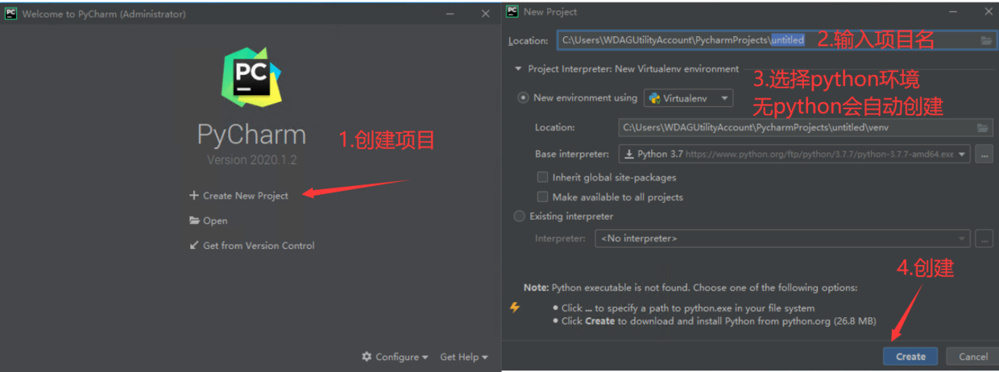
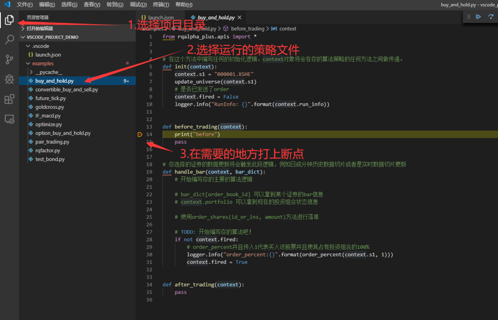

# PyCharm及vscode快速配置RQSDK上手 说明文档  

## PyCharm及 VS Code 快速配置RQSDK上手

### PyCharm

#### 为什么要用PyCharm？

* PyCharm 作为 IDE（集成开发环境），再带 python 解释器和虚拟环境管理功能，开箱即用
* PyCharm 默认的内置功能极为丰富（Git、数据库支持、框架支持等），无需手动配置插件便可直接使用
* PyCharm 内置了在业界无出其右的静态代码审查（code inspect）功能

#### PyCharm 下载

[官网](https://www.jetbrains.com/pycharm/)提供了专业版和社区版下载。

* 专业版用于科学计算和 Web 开发。同时具有 HTML、JS 和 SQL 等支持。专业版 PyCharm 支持试用30天。

* 社区版用于通常的 Python 开发。免费且开源。

#### 创建 PyCharm 工程（Project）

下载且安装完成 PyCharm 后，便可打开 Pycharm 后建立一个工程。该阶段可以设置项目使用的 Python 解释器/虚拟环境，后续开发中的代码提示、调试等功能都依赖为工程配置的虚拟环境：

1. 点击 Create New Project 按钮
2. 展开 Project interpreter
3. 选择虚拟环境（若没有已存在环境，则 PyCharm 会自动创建）
4. 点击 Create 按钮



*如果没有python环境 ，编辑器右下角会有进度条提示python的安装进度。*

工程创建完成后，亦可在设置中修改当前工程使用的虚拟环境：

1. 点击左上角菜单栏FIle -> Settings（macOS 中为 PyCharm -> Preference）
2. 点击 Project: **** -> Project Interpreter
3. 点击右边小齿轮 -> Show All
4. 点击加号（+） -> 选择虚拟环境（Virtualenv Environment) 或者 Conda 环境（Conda Environment) `


#### 在 PyCharm 中安装 RQSDK

若当前工程配置的虚拟环境中还未安装 RQSDK，可以直接在 PyCharm 中调用终端（terminal）安装，PyCharm 会自动在改终端激活先前配置好的虚拟环境。
若点击左下角 Terminal 以激活终端，输入以下代码以安装 RQSDK

``` bash
pip install -i https://pypi.douban.com/simple rqsdk     
```

#### 使用 PyCharm 编写代码

* 创建 Python 模块（module）`鼠标右键项目文件夹 -> New -> Python File -> 输入文件名`


* 若当前工程正确配置了虚拟环境，且虚拟环境中安装了 RQSDK，在 py 文件中输入“rq”时便可以看到 PyCharm 给出的代码提示


* 在 py 文件中输入代码，如使用 RQDatac 调取日线数据：

```python
import rqdatac    
    
rqdatac.init()    
print(rqdatac.get_price("000001.XSHE"))    
```

* 在编辑区域点击右键执行 Run... 便可以运行当前模块，注意，上述代码的运行要求事先使用 `rqsdk license` 命令配置好 license。


* 当用了 `rqsdk install rqalpha_plus` 后，当前python环境也会有 rqoptimizer 和 rqfactor

#### 使用 PyCharm 运行回测

回测在终端中需要通过 rqalpha-plus 命令而非 python 命令运行，故在 PyCharm 中运行回测需要进行一些额外的配置，以简单的 buy-and-hold 回测策略为例。

1 创建名为 buy_and_hold 的 python 模块并键入以下代码：

```python
# buy_and_hold.py    
    
def init(context):    
    context.s = "000001.XSHE"    
    context.fired = False    
        
def handle_bar(context, bar_dict):    
    if not context.fired:    
        order_shares(context.s, 1000)    
        context.fired = True    
 ```

2 点击右上角的 `Add Configuration`


3 在打开的窗口中将第一项左侧默认的运行方式由 `Script path` 修改为 `Module name`
4 设置 `Module name` 为 `rqalpha_plus`，设置 `Parameters` 为回测运行的子命令 `run` 及其参数，如：

```shell
run -f buy_and_hold.py -s 20190101 -e 20191231 -a stock 20000 --plot    
```


5 点击 OK 按钮以完成配置
6 点击右上角的三角形按钮以运行回测，或点击虫子按钮以调试（debug）代码


---

### Visual Studio Code (VS Code)

#### 为什么要用 VS Code？

1. 轻量化，下载安装更快；资源占用低，对配置相对不足的计算机更友好
2. 启动快速，首次创建工程时没有漫长等待创建索引的过程
3. 生态健全，有着丰富的第三方主题和插件

在[Visual Studio Code](https://code.visualstudio.com/)官网可以下载标准版。

#### 安装 Python 插件（Extensions）

VScode 不是 python 专用的编辑器，故使用其开发 python 需要安装专门的插件支持才能获得代码提示、审查、调试等功能：

* 在左侧栏点击 Extensions 后，搜索 python，选择搜索到的第一项并点击 `install` 按钮安装。


#### 设置虚拟环境/Python 解释器

* 使用 Ctrl+Shift+P 快捷键（macOS 为 Command+Shift+P）打开 command palette 窗口
* 输入关键字 `python select` 并找到 `Python: Select Interpreter` 一项， 点击该项并在随后弹出的 Python 解释器列表中选择目标虚拟环境中的解释器（若目标虚拟环境未列出，则需要手工输入解释器的路径）

#### 使用 VS Code 编写代码

* 新建一个文件夹
* 将文件夹拖入到VS code 窗口
* 创建py文件 `open folder -> new file   文件名:demo_rqdatac.py`


* 使用rqdatac 查看平安银行日线数据

文件中输入以下代码：

``` python
import rqdatac    
    
rqdatac.init()    
print(rqdatac.get_price("000001.XSHE"))    
```


* 运行rqalpha-plus
生成样例策略并运行


运行样例策略需要的命令如下 (假设conda环境名为py35)

``` python
conda activate py35    
pip install rqsdk -i https://pypi.douban.com/simple/     
rqsdk install rqalpha-plus    
rqsdk download-data    
rqalpha-plus examples    
rqalpha-plus run -f examples/buy_and_hold.py -s 2018-01-01 -e 2018-05-31 -fq 1m --plot --account stock 1000000    
```

命令对应作用如下：

* 激活名为 py35 的 conda环境，如果没有则输入conda create -n py35
* 安装 rqsdk和rqalpha-plus
* 生成样例策略文件夹
* 使用 examples 的 buy_and_hold.py 策略启动回测

#### 用debug方式运行回测


launch.json配置如下

```json
{    
    // 使用 IntelliSense 了解相关属性。     
    // 悬停以查看现有属性的描述。    
    // 欲了解更多信息，请访问: https://go.microsoft.com/fwlink/?linkid=830387    
    "version": "0.2.0",    
    "configurations": [    
        {    
            "name": "Python: 模块",    
            "type": "python",    
            "request": "launch",    
            "module": "rqalpha-plus",    
            "args": ["run", "-f", "examples\\buy_and_hold.py", "-s", "2018-01-01", "-e", "2018-05-31", "-fq", "1m", "--plot", "--account", "stock", "1000000"]    
        }    
    ]    
}    
```

---




