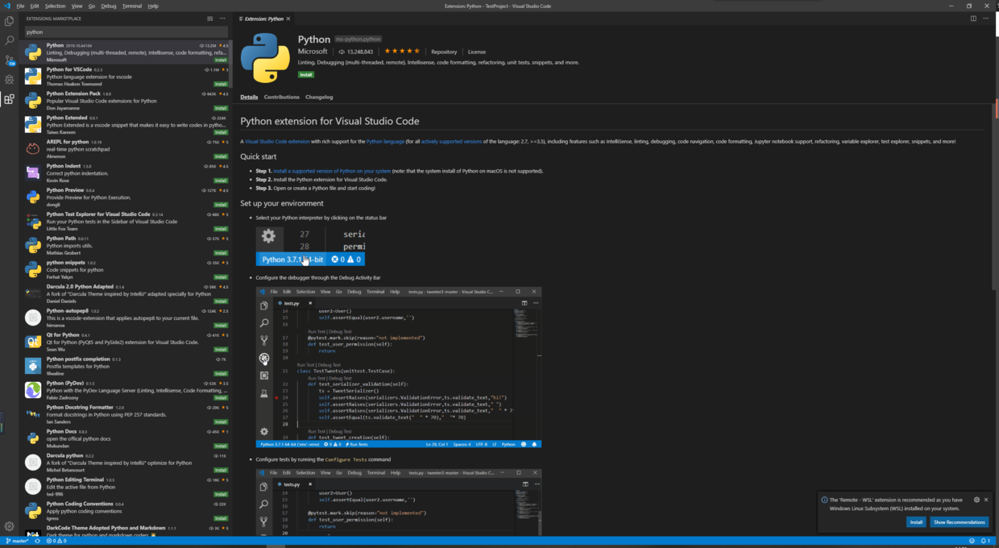
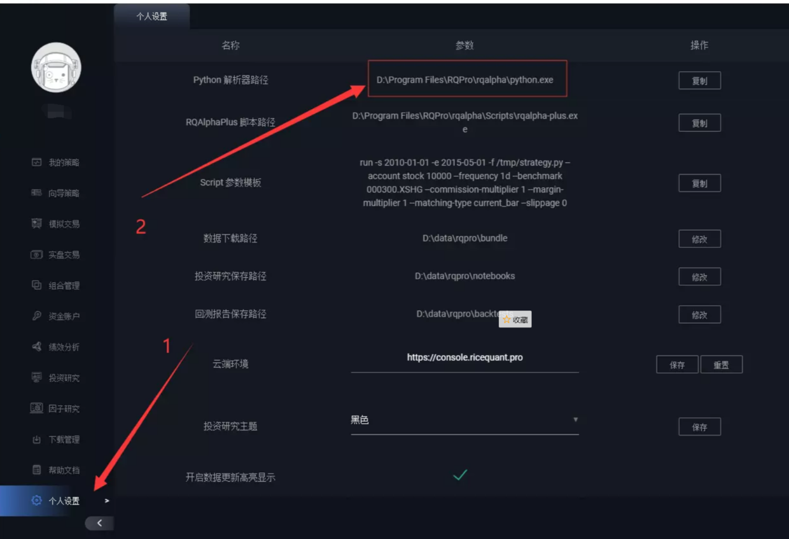
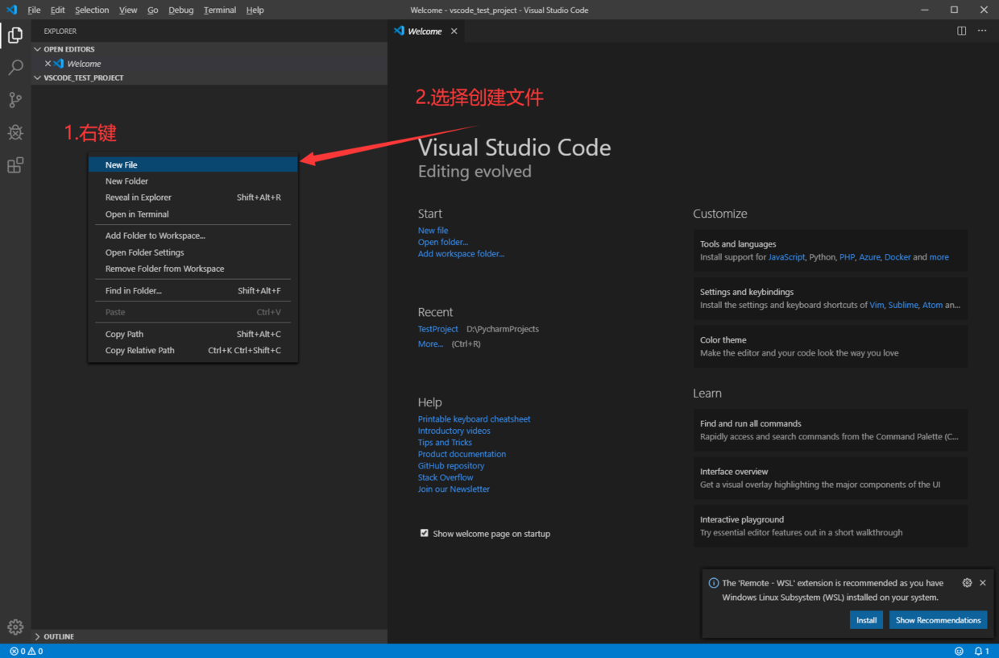
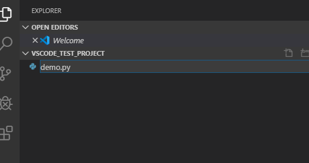
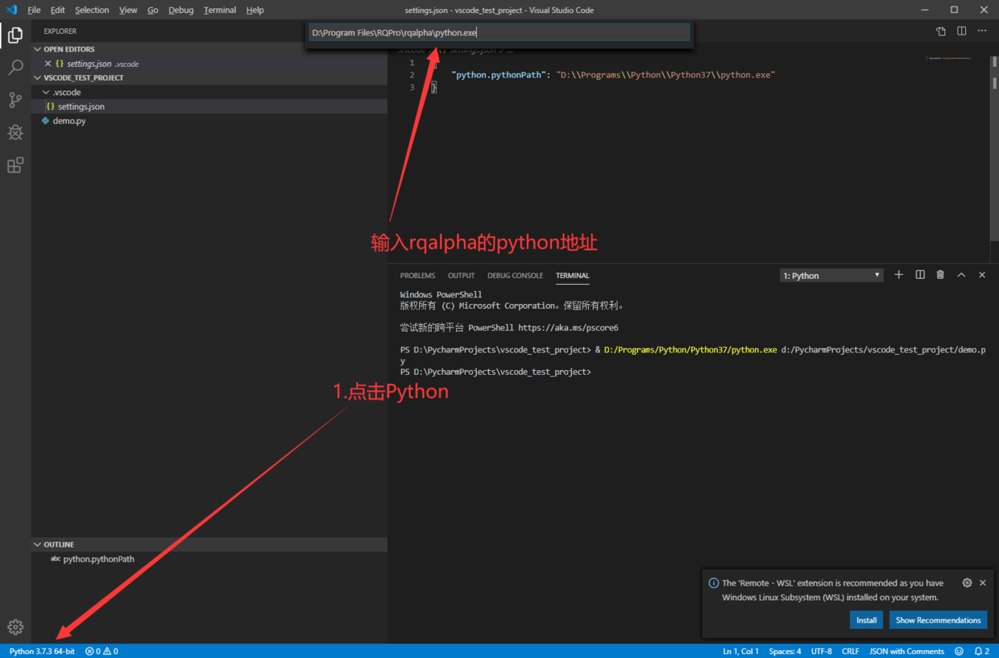
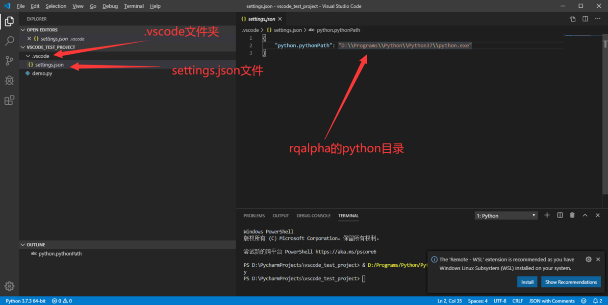
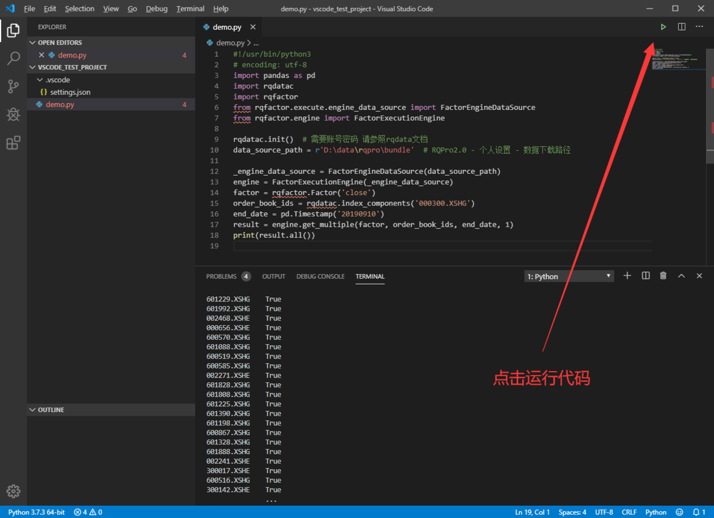
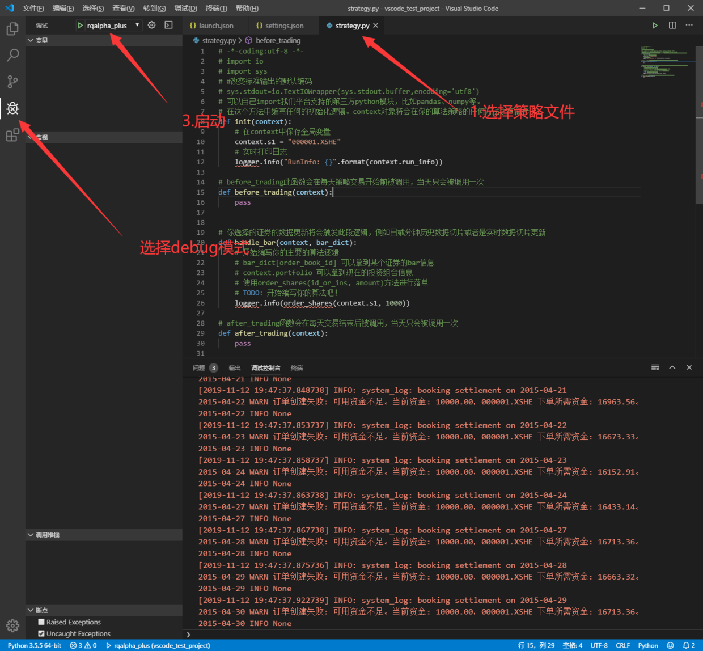

# RQPro2.0 本地环境与 VScode 集成

RQPro2.0 与 VS code 的集成

## 安装 Python Extensions



- 点击 `install`安装
- 安装后重启 VS code

## 获取 rqpro python 环境路径



本机的 rqalpha python 环境路径为  `D:\Program Files\RQPro\rqalpha\python.exe`

## 新建项目

1. 新建一个文件夹
2. 将文件夹拖入到 VS code 窗口
3. 创建一个。py 文件





## 配置 python 环境



### 如果不能选择此 python

需要做如下修改

1. 选择项目文件夹下 `.vscode` 文件夹下 settings.json 文件 （没有文件或文件夹则创建）
2. 将"python.pythonPath"的值改为 python.exe 路径（注意双反斜杠转义）


## 使用 rqdatac 与 rqfactor

输入下列代码

``` python
#!/usr/bin/python3    
# encoding: utf-8    
import pandas as pd    
import rqdatac    
import rqfactor    
from rqfactor.execute.engine_data_source import FactorEngineDataSource    
from rqfactor.engine import FactorExecutionEngine    
    
rqdatac.init()  # 需要账号密码 请参照 rqdata 文档    
data_source_path = r'D:\data\rqpro\bundle'  # RQPro2.0 - 个人设置 - 数据下载路径    
    
_engine_data_source = FactorEngineDataSource(data_source_path)    
engine = FactorExecutionEngine(_engine_data_source)    
factor = rqfactor.Factor('close')    
order_book_ids = rqdatac.index_components('000300.XSHG')    
end_date = pd.Timestamp('20190910')    
result = engine.get_multiple(factor, order_book_ids, end_date, 1)    
print(result.all())    
    
点击右上角绿色三角形运行 python 代码    
```



## 运行 RQAalpha 回测

在 `.vscode`文件夹下 `launch.json`中输入如下代码：

``` json
{    
    // Use IntelliSense to learn about possible attributes.    
    // Hover to view descriptions of existing attributes.    
    // For more information, visit: https://go.microsoft.com/fwlink/?linkid=830387    
    "version": "0.2.0",    
    "configurations": [    
        {    
            "name": "rqalpha_plus",    
            "type": "python",    
            "request": "launch",    
            "module": "rqalpha_plus",    
            "args": [    
                "run", "-s", "2015-03-01", "-e", "2015-05-01",     
                "-f", "${file}",    
                "--account", "stock", "10000", "--frequency", "1d", "--benchmark", "000300.XSHG",     
                "--commission-multiplier", "1", "--margin-multiplier", "1", "--matching-type", "current_bar", "--slippage", "0"    
            ],    
            "env": {"PYTHONIOENCODING": "utf-8"}    
        }    
    ]    
}    
```

- 选择策略文件 使用 debug 模式运行


