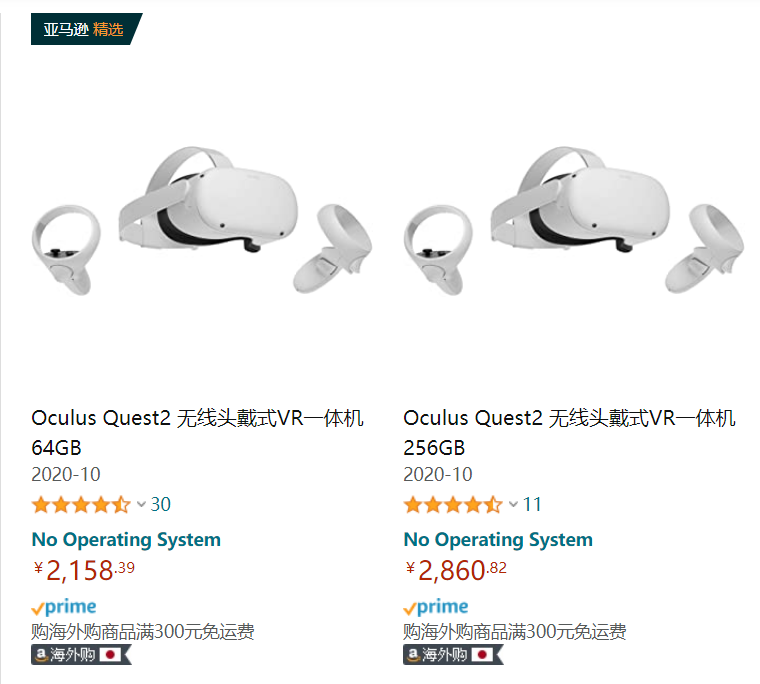

# VR 游戏感想

- oculus quest2 本文中简称 OC2

---

## 问题由来

最近发行的 oculus quest2 的价格已经到 2k+了，广告铺天盖地的。

对于这件事情，让我想起了小米发布第一部手机时，1999 价格出来的那一刻。

此时，同等价位其他手机卖不出去，大家都得把手机价格打下来**手机行业开始内卷**。

---

OC2 出现了 199 美元，这个和小米 1999RMB 的小米 1 一样的感觉，感觉 VR 硬件也发展成熟，要打价格战的时候了。知乎上说 OC2 对标的是 NS。确实 2k 多 买个 NS 游戏还得花很多钱，OC2 无限连接电脑玩 Steam 上的游戏要爽得多。

OC2 目前我觉得的优点：

- 2 基于四个摄像头定位，不再需要定位传感器。
- 支持无线串流 无需线材就能上 Steam 玩游戏（得要好 wifi）。
- 自带游戏平台，没得显卡一样能玩。

所以，当前的 VR，2k 就得到一个很好的体验了，也不需要太多场地，当然，**得会用梯子**。

设备价格下来了，那么应用市场则会更大，玩家有更多购买游戏（玩盗版）的机会。

VR 目前还没出现内卷，先到先占位，OC2 作为第一个开始，打破市场的商家，马上硬件会产生内卷现象，然后 VR 软件业蓬勃发展。目前我觉得是个风口。

---

## HOW TO DO

风口来了，当然想进去赚钱，要么打工，要么提供打工。

### 打工

- 首先，本人只想做 python 相关的后端。
- 其次，还想 [逃离 996 环境] - [[远程工作分析]]。

在深圳找了找，VR 游戏公司只有三四家，且基本上不要 python。（还在继续找。..)

---

### Another choice

机缘巧合下，和一个游戏运营大佬聊了聊。大佬目前在开 VR 体验店（据说是在赔钱）。

以下是大佬的观点：

在深圳，所有的互联网企业离不开腾讯阿里，基本上背后都腾讯和阿里的投资。那么做 IT 的，最终目标有两个，要么进入阿里腾讯，要么公司被阿里腾讯收购，似乎没有别的路走（有的话请留言）。

考虑自己做工作室 or 进腾讯阿里，之前的工作室散伙，优秀的去了腾讯，不优秀的留在了市场。

觉得自己能行，从腾讯出来创业的，最后还是要么被腾讯投资控股，要么被腾讯投资控股的公司打败。`大部分从腾讯出来的混的好像不咋样。`

如果自己有闲钱，可以考虑找几个伙伴合伙做游戏。

先了解下这几个游戏：

- vr 和键鼠同时支持的游戏 payday2
- 三消做得非常棒的游戏 mirro （自带官网 18h 补丁）

用 Unity 或者 RPG maker 做一点自己的成品。（虚幻 4 要收费）

---

## 目前想法

- 考虑深圳的 vr 公司
- 独立游戏工作室
- 做成一个游戏后，上 steam 平台。证明自己 。（考虑反着抄 把同样的模式抄到不同领域）

ps, 网上有说 python 能开发 unity 3d 的程序，我只找到了 python2 的开发方式。[参考。](https://www.zhihu.com/question/66028320/answer/237473929)

ps. 公司选择范围小的话，可以选择精投。 大概推荐以下做法

- 带自荐信。
- 了解这个公司内部架构和人员信息。
- 按对方需求写简历。
- 找到内部人员内推。

