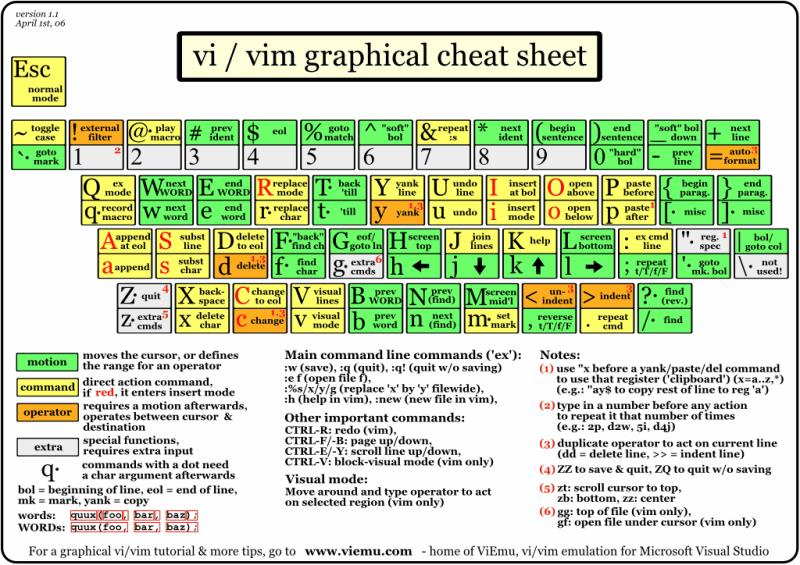
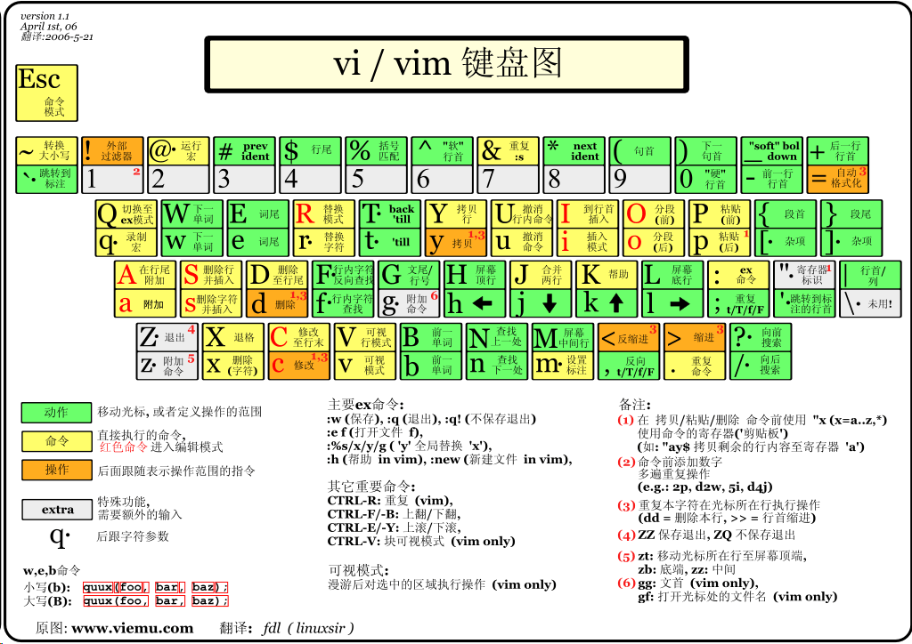

# Vim 笔记

推荐一下 vim 的视屏学习  
[玩转 Vim 从放弃到爱不释手 - PegasusWang](https://www.imooc.com/learn/1129)  

这是个人对 PegasusWang 视屏学习笔记  

  

---

图片来自 [RUNOOB](https://www.runoob.com/w3cnote/all-vim-cheatsheat.html)  

  

---

``` bash
a append
i insert 
o open a line below

A append after line 
I insert before line
O append a line above
```

---

``` bash
vs vertical split 
sp split 

普通选择 v
选择行 V
ctrl + v 方块选择

y 复制

ctrl + h 删除上一个字符
ctrl + w 删除上一个单词
ctrl + u 删除当前行
ctrl + a 跳到开头
ctrl + e 跳到结尾

快速回到最后编辑 gi
```

---

``` bash
w/W 移到下一个 word/WORD 开头
e/E 下一个 word/WORD 结尾
b/B 回到上一个 word/WORD 开头 backword

f{char} 移动到 char 字符上 F{char} 向前搜索
t{char} 移动到 char 的前面字符上
;, 选择上一个下一个

0 移动到行头 ^移动到行头非空白
$ 移动到行尾 g_移动到行尾非空白

() 在句子间移动
{} 在段落间移动

:help 查看帮助

gg/G 移动到文件开头和结尾  
ctrl+o 快速返回
H/M/L 跳到屏幕的 Head / Middle / Lower
Ctrl +u / Ctrl +f 上下翻页 upword / forward  
zz 把当前行设置为屏幕中间
```

---

``` bash
d 配合使用删除一个单词
x 删除一个字符

dw 删除单词光标及之后的
daw 删除单词包括之后的空格
diw  删除单词

r replace 替换一个字符 R 不断替换
s substitute 插入模式 S 整行删除进入插入模式
c change  
c t {char} 删除 到 char 并进入插入模式

/ or ? 向前向后搜索
n/N 上一个 下一个匹配
\* \# 向前向后匹配 直接搜索当前光标的单词
```

---

``` bash
vim 替换命令
    :[range] s[ubstitute]/{pattern}/{string}/[flags]
    range 表示范围 比如 :10, 20 表示 10-20 行，%表示全部
    pattern 是要替换的模式，string 是替换后文本
Flags 有几个常用的标志
    g(global) 表示全局范围内执行
    c(confirm) 表示每次确认  
    n 报告匹配的到的次数而不替换 可以用来查询匹配次数
```

---

``` bash
vim 复制粘贴与寄存器

normal 模式下复制粘贴：
y(yank) 复制
p(paste) 粘贴
d 删除
使用 d 和 p 组合可以达到剪切的效果

visual 模式下选择，normal 模式下再使用 p 粘贴

yiw 复制一个单词 p 粘贴
yy 复制一行 p 粘贴
dd 删除一行 p 粘贴

insert 模式下的粘贴
Ctrl+v(Windows)
Cmd+v(MacOs)
鼠标右键-粘贴
```

---

``` bash
Ctrl + n / ctrl + p 补全单词
ctrl+x ctrl+f 补全文件名
ctrl +x ctrl +o 补全代码
```

---

Vim-plug  
https://github.com/junegunn/vim-plug  
插件搜索：  
https://vimawesome.com/  

启动界面  
https://github.com/mhinz/vim-startify  

修改启动界面：https://github.com/mhinz/vim-startify  
状态栏美化：https://github.com/vim-airline/vim-airline  
增加代码缩进线条：https://github.com/yggdroot/indentline  

``` vim
call plug#begin('~/.vim/plugged')
Plug 'mhinz/vim-startify'  " 修改启动界面
Plug 'vim-airline/vim-airline'  " vim 状态栏美化
Plug 'vim-airline/vim-airline-themes'  " vim 状态栏美化
Plug 'yggdroot/indentline'  " 增加代码缩进线条
Plug 'w0ng/vim-hybrid'  " 主题 :colorscheme hybrid

Plug 'scrooloose/nerdtree' " 文件目录
Plug 'ctrlpvim/ctrlp.vim' “ 模糊查找
Plug 'easymotion/vim-easymotion'  " 文内映射
Plug 'tpope/vim-surround'  " 单双引号 修改  ds  cs ys 
Plug '/usr/local/opt/fzf'  " 模糊搜索 
Plug 'junegunn/fzf.vim' " 模糊搜索 Ag 模糊搜索字符串 Files 模糊搜索目录
Plug 'brooth/far.vim'  "  批量替换
Plug 'majutsushi/tagbar'   "   浏览代码用

" Initialize plugin system"
call plug#end()
```

---

``` bash
vim-go go ide
python-mode python 综合 mode
jedi-vim 代码补全
vim-interestingwords 高亮感兴趣的单词
neovim/vim8 异步补全插件
tpope/vim-commentary 代码注释
```

---

``` bash
git 相关
vim-fugitive vim 里用 git
vim-gitgutter vim 里显示文件变动
gv.vim 查看代码提交记录
```

---

Tmux 强大的终端管理器  

neovim 替代 vim  

https://github.com/PegasusWang/vim-config  

---

《Practical vim》  
《笨方法学 vimscript》  
