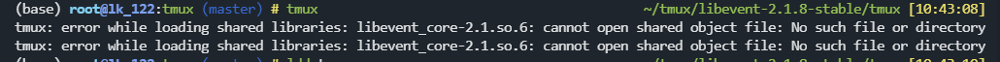

# centos 安装 tmux

- 参考 [tmux-Installing](https://github.com/tmux/tmux/wiki/Installing)
- 参考 [CentOS 升级 tmux 1.8 到最新版](https://blog.csdn.net/gneveek/article/details/82803909)
- [Tmux 快捷键 & 速查表 & 简明教程](https://gist.github.com/AngusWG/44043bee8a0e4c39331443ef71efc9b7)

先设置个代理

``` bash
export http_proxy="http://192.168.31.31:9999"
export https_proxy="http://192.168.31.31:9999"
```

## 安装前置依赖

``` bash
yum install libevent ncurses
yum install libevent-devel ncurses-devel gcc make bison pkg-config
```

## 安装

``` bash
wget https://github.com/tmux/tmux/releases/download/3.2a/tmux-3.2a.tar.gz
tar -zxf tmux-*.tar.gz
cd tmux-*/
./configure
make && sudo make install
```

## 检查

```bash
tmux -V
```

`搞定`


推荐一个使用说明（最下面有个配置推荐 放好~/.tmux.conf 然后重开就好了）

- [Tmux 快捷键 & 速查表 & 简明教程](https://gist.github.com/AngusWG/44043bee8a0e4c39331443ef71efc9b7)

## 找不到 libevent 的问题

`tmux: error while loading shared libraries: libevent_core-2.1.so.6: cannot open shared object file: No such file or directory`



```bash
cp /usr/local/lib/libevent-2.1.so.6 /lib64/libevent-2.1.so.6
cp /usr/local/lib/libevent_core-2.1.so.6 /lib64/libevent_core-2.1.so.6
```


