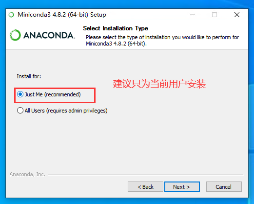
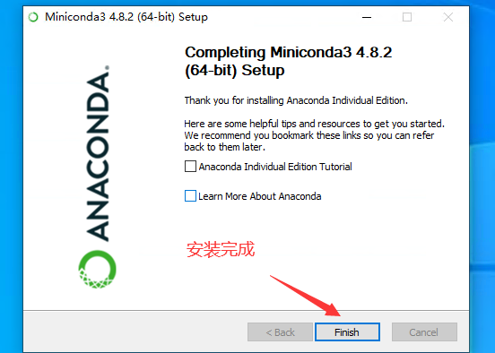
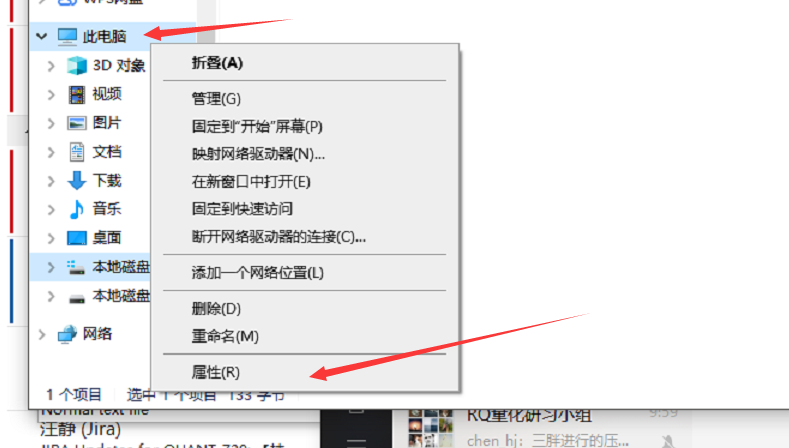
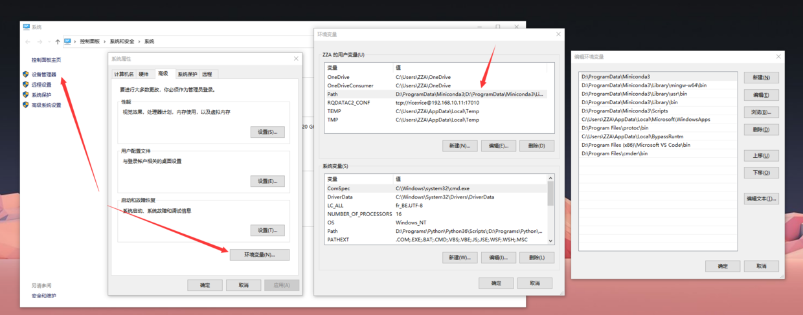
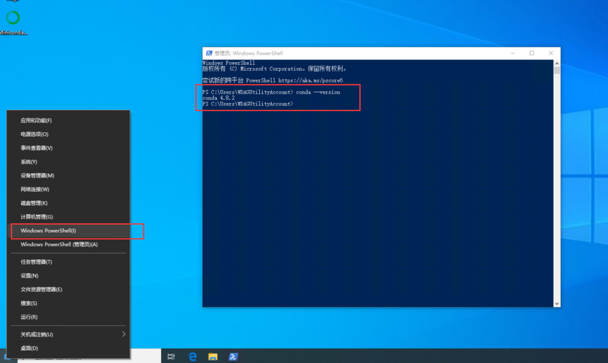

# conda 与 rqdatac 教程

## 什么是 conda

conda 是一个包、依赖、环境管理工具。方便 python 间环境隔离。
conda 可以创建许多单独的 python 环境，这些 python 环境相互隔离，当其中一个 python 环境因为改动或其他原因错误时，不会影响其他 python 环境。

## 为什么装 miniconda

参考 [miniconda 清华源](https://mirrors.tuna.tsinghua.edu.cn/help/anaconda/)

## 下载 miniconda

去 [清华源](https://mirrors.tuna.tsinghua.edu.cn/anaconda/miniconda/) 下载一个 miniconda 并安装

- [windows 4.8.2 版 miniconda](https://mirrors.tuna.tsinghua.edu.cn/anaconda/miniconda/Miniconda3-py38_4.8.2-Windows-x86_64.exe)
- [mac 版 4.8.2miniconda](https://mirrors.tuna.tsinghua.edu.cn/anaconda/miniconda/Miniconda3-py38_4.8.2-MacOSX-x86_64.pkg)

下载后 如下几个需要手动改一下





- 对于部分没有点添加到环境变量的小伙伴 请按如下操作添加`环境变量`




``` bash
例如默认路径为：”C:\Users\Administrator\Miniconda3”, 那么需要添加的三个路径则是：     
1）C:\Users\Administrator\Miniconda3；     
2）C:\Users\Administrator\Miniconda3\Scripts；     
3）C:\Users\Administrator\Miniconda3\Library\bin     
第一个路径是 Miniconda 的根目录，也是最重要的路径！    
    
* 如果你的环境变量中已经存在这三个路径，那么就不用添加了。    
```

---

## 运行 miniconda

右键开始菜单，打开`Windows PowerShell`  (**可选**: 输入 conda activate base 启动 base 环境）



此时就已经有 python 了

可以输入 `conda --version` 看一看版本

---

## pip 配置默认镜像源

pip 默认下载源在国外，改为国内后，安装各种依赖会快很多。

- 在 cmd 命令行下 运行如下命令

```bash
pip config set global.index-url http://pypi.douban.com/simple    
pip config set global.trusted-host pypi.douban.com    
```

```bash
pip config set global.index-url https://pypi.tuna.tsinghua.edu.cn/simple    
pip config set global.trusted-host pypi.tuna.tsinghua.edu.cn 
```

---

## 下载使用 rqdatac

- 创建 python 3.8 虚拟环境
`conda create -n py38 python=3.8.2`

- 激活环境
`conda activate py38`

- 安装 rqdatac
`pip install rqdatac`
*如果安装了 zsh  请执行命令`rehash`*

- 安装 ipython *(ipython 补全功能非常亲民）*
`pip install ipython`

## 使用 rqdatac

- 输入`ipython` 然后按如下操作

```python3
import rqdatac    
rqdatac.init("手机号","密码")    
rqdatac.user.get_quota()    
#{'bytes_used': 742981, #已使用流量    
# 'bytes_limit': 52428800.0, # 总流量    
# 'remaining_days': 760, # 剩余使用天数    
# }    
rqdatac.all_instruments()    
#      order_book_id       symbol  ... listed_date de_listed_date    
#0        M1901P3650  豆粕 1901 沽 3650  ...  2018-04-10     2018-12-07    
#1       SR1901C4900  白糖 1901 购 4900  ...  2018-04-17     2018-11-26    
#2       SR1907C5400  白糖 1907 购 5400  ...  2018-01-17     2019-05-27    
#3        M1907P2900  豆粕 1907 沽 2900  ...  2018-07-17     2019-06-10    
    
rqdatac.instruments("000001.XSHE")    
# Instrument(order_book_id='000001.XSHE', industry_code='J66', market_tplus=1, symbol='平安银行', special_type='Normal', exchange='XSHE', status='Active', type='CS', de_listed_date='0000-00-00', listed_date='1991-04-03', sector_code_name='金融', abbrev_symbol='PAYH', sector_code='Financials', round_lot=100, trading_hours='09:31-11:30,13:01-15:00', board_type='MainBoard', industry_name='货币金融服务', citics_industry_code='40', citics_industry_name='银行')    
    
rqdatac.get_price("000001.XSHE")    
#            num_trades  limit_down       volume  ...   high   open    low    
#date                                             ...                         
#2020-01-10     37440.0       15.11   58554845.0  ...  16.81  16.79  16.52    
#2020-01-13     42233.0       15.02   87213336.0  ...  17.03  16.75  16.61    
#2020-01-14     60290.0       15.29  130449366.0  ...  17.27  16.99  16.76    
#2020-01-15     60129.0       15.08   85943912.0  ...  16.86  16.79  16.4    
```

## conda 基本操作

- 查看版本信息 `conda --version`
- 更新 conda `conda update conda`
- 创建一个虚拟环境 `conda create -n py38 python=3.8.2`
- 激活新的虚拟环境 `conda activate py38`
- 列出环境信息 `conda env list`
- 退出当前环境 `conda deactivate`
- 删除虚拟环境`conda remove --name py38 --all`
