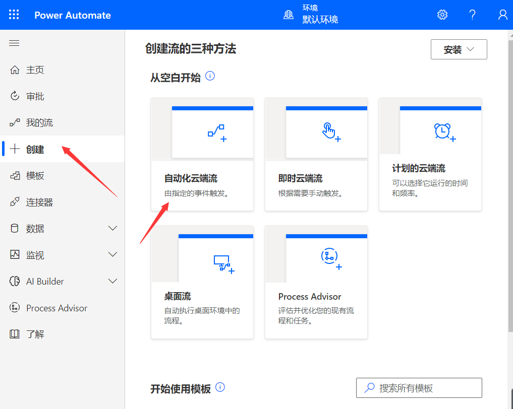
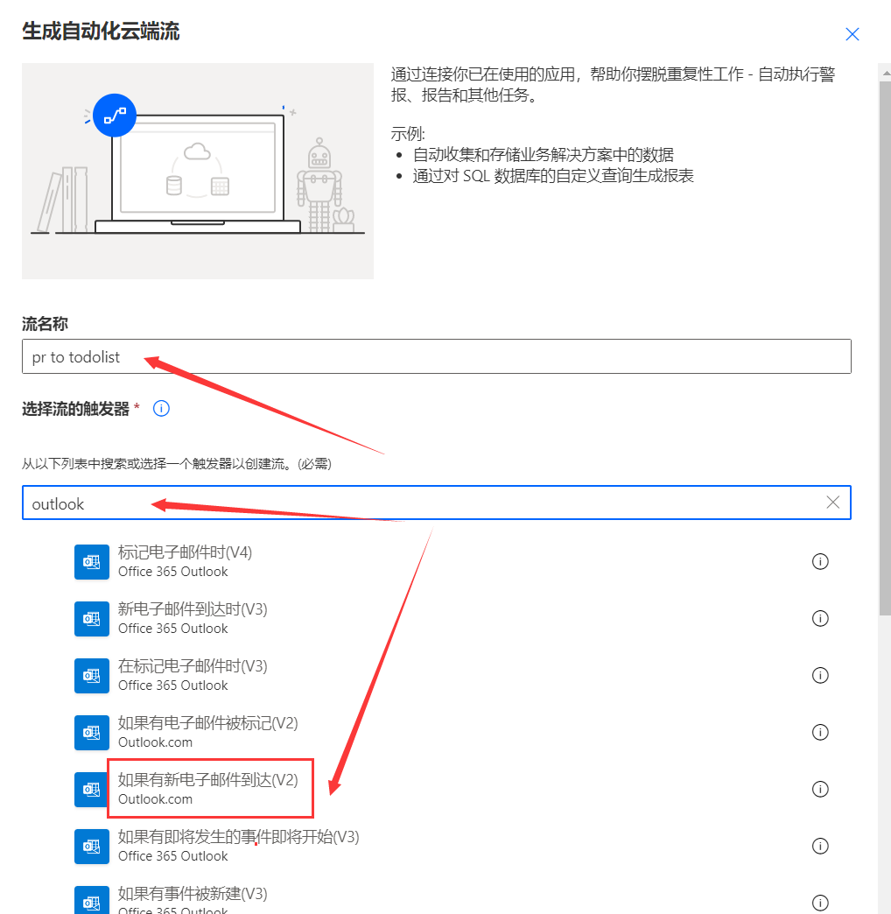
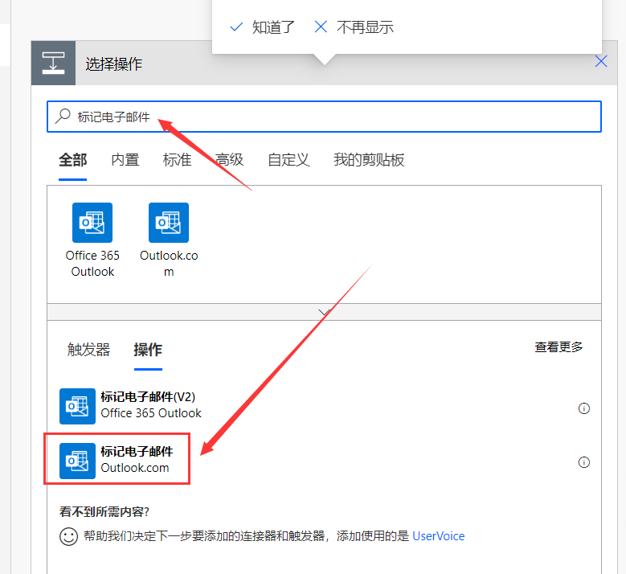
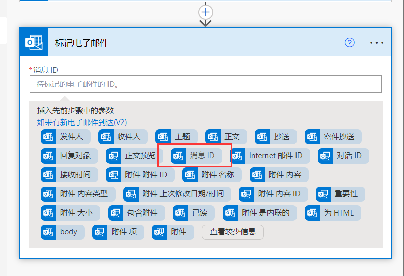
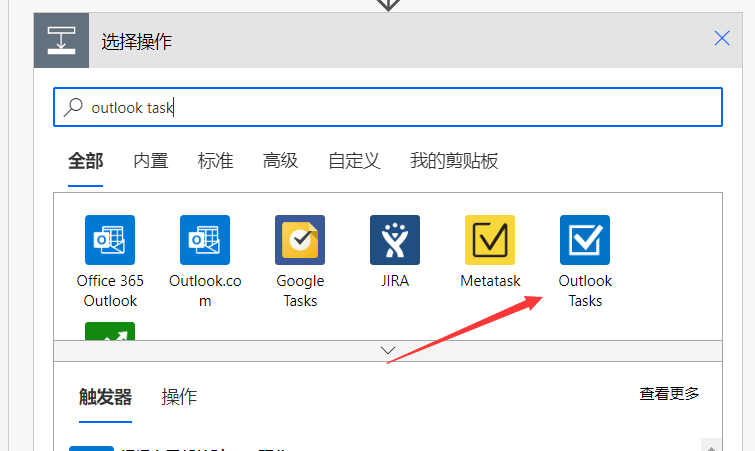
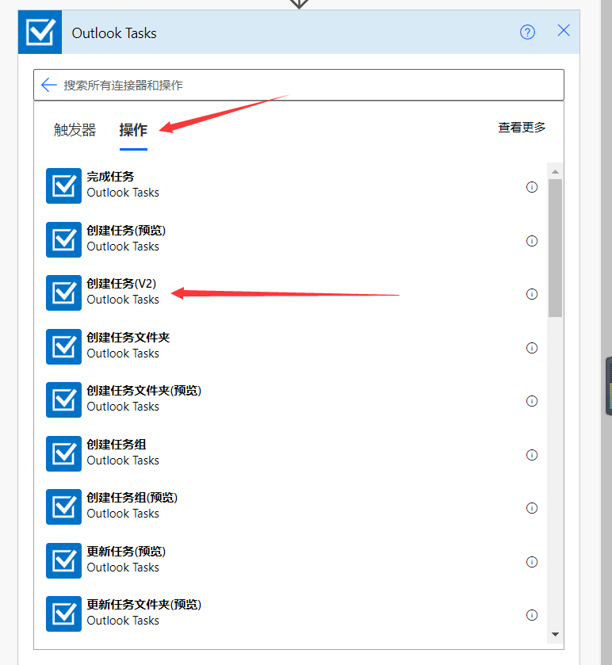
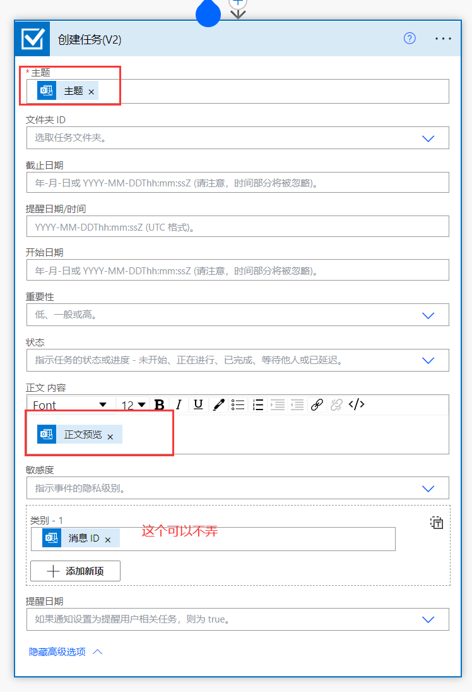

# outlook 支持将邮件自动转入待办

- 此处用 pull request 自动转入待办做一个创建待办事项的案例。
- 在 outlook 邮件中，**右键标记邮件**可以将邮件自动转入**微软的待办清单**中。

## pull request 自动转入待办

- 登录 [power automate](https://make.powerautomate.com/)

- 右侧栏点击创建。
  - 自动化云端流。

- 流名称随意写 例如 **pr to todolist**。
- 触发器 搜索 *outlook* 选择 **如果有新邮件到达 (V2)**。
  - 注意是 outlook.com v2 版本，不要选择 office 365 outlook 版本。

- 文件夹根据自己需求选择，我这里选择**收件箱**。
- 点击显示高级选项。
  - 主题筛选器处，根据需求，输入 **pull request**。
  - 也可以自定义收件人或者其他属性。

- 点击 **新步骤** 搜索 **标记电子邮件** 。
  - 同样选择 Outlook.com 版本。

- **消息 ID** 点击后选择 **消息 ID**。

- 点击保存。

---

✌️好了可以用了另外一个邮箱写一封标题包含 pull request 的邮件，测试一下🎇。

---

## 自定义待办事项

- 点击 **新步骤** 搜索 **Outlook task**。

- 点击 **操作** 选择 **创建任务 (V2)**。

- 输入以下下内容。

- 点击保存。 可以测试。
