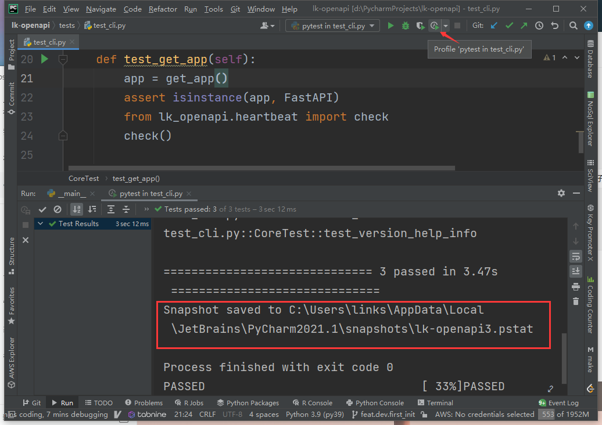
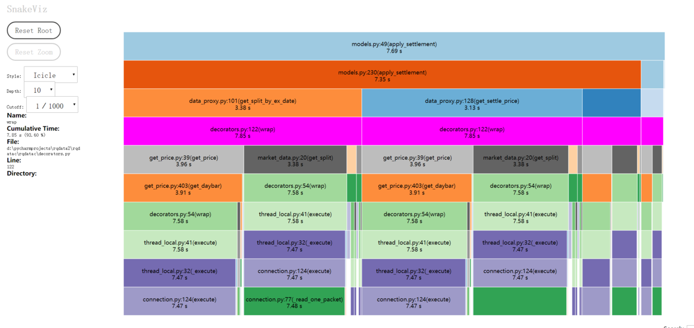
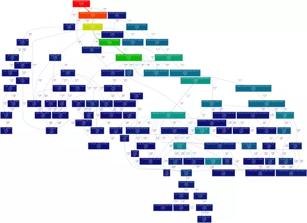

# python 性能分析  

相关资料:

* [Python 优化第一步: 性能分析实践](https://juejin.im/entry/5873a216a22b9d00589c25e0)  
  
## 安装依赖  

```bash  
pip install pstats  
pip install snakeviz  
```  

---  

## 获取程序运行数据

### 通过cProfile获取性能分析数据

* cProfile自python2.5以来就是标准版Python解释器默认的性能分析器。
* cProfile是一种确定性分析器，只测量CPU时间，并不关心内存消耗和其他与内存相关联的信息。

```python
def run_1():  
  """your function """  
  pass  
  
  
def profile_func(func):  
  import cProfile  
  file_name = "prof_{}_1.pstat".format(func.__name__)  
  cProfile.run("{}()".format(func.__name__), file_name)  
  import pstats  
  p = pstats.Stats(file_name).sort_stats("cumtime")  
  # p.print_stats("rqalpha_mod_ricequant_data")  
  p.print_stats("base_position")  
  return p  
  
  
if __name__ == '__main__':  
  p = profile_func(run_1)
```

### 通过pycharm直接获取运行数据

Pycharm 右上角启动按钮旁边有性能分析按钮，  
点击后会自动弹出pycharm自带的性能分析界面，  
当然也可以复制`.pstat`文件地址，使用`snakeviz`进行分析(推荐)。



---  
  
## snakeviz 生成剖面图  

运行目录下 命令行输入：`snakeviz prof_run_1_1.pstat`  

点击生成的连接 查看柱状剖面图  

  
  
---  

## gprof2dot 时间分析图

`gprof2dot -f pstats mkm_run.prof | dot -Tpng -o mkm_run.png`  

  


