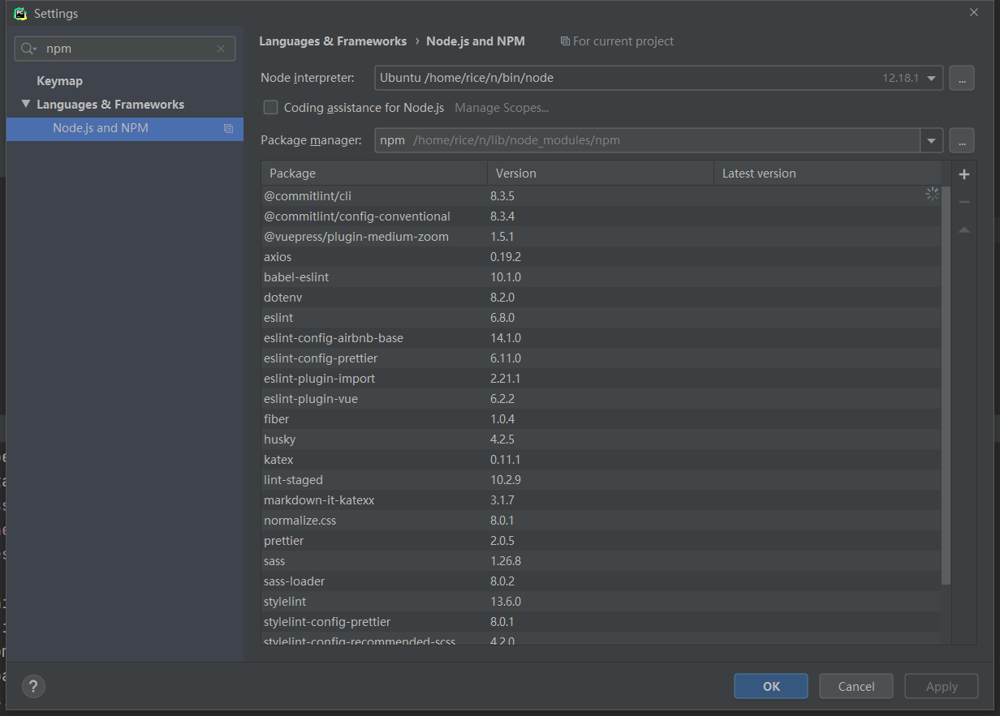
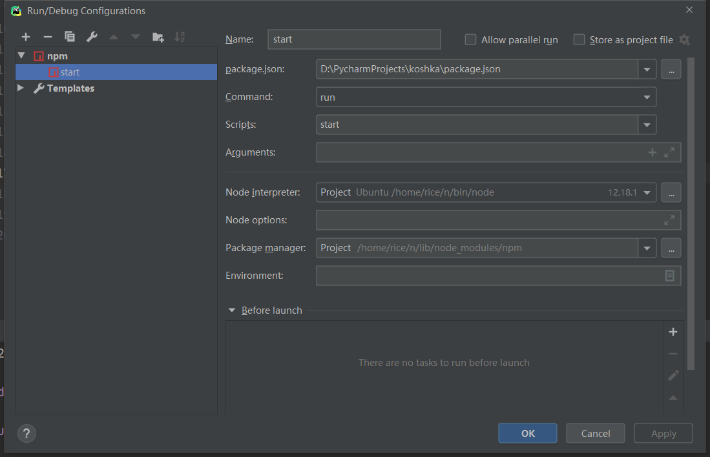

# wsl 上装 node  

安装 Node.js

> curl -L https://git.io/n-install -x 127.0.0.1:9999 | bash
> npm config set registry https://registry.npm.taobao.org

# pycharm 配置 npm

# windows 文件 \r 结尾问题

sudo apt-get install dos2unix
