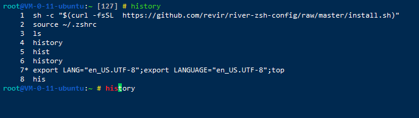
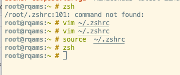
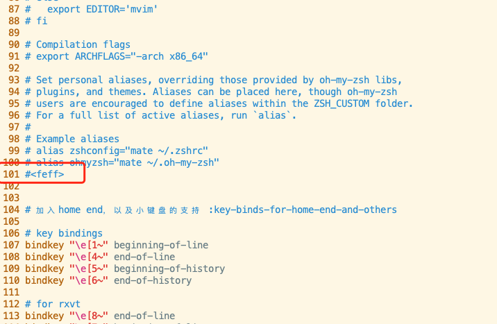

# zsh 安装  

- 有多好用。.. 自行百度



## SH 安装脚本

`命令不是打错了  相同命令确实需要运行两遍`

``` bash
export http_proxy="http://192.168.100.228:9999"
export https_proxy="http://192.168.100.228:9999"

sh -c "$(curl -fsSL  https://github.com/AngusWG/river-zsh-config/raw/master/install.sh)"
source ~/.zshrc
```

## 自动安装

- zsh
- oh my zsh
- 彩色命令
- 历史提示

[sh 脚本所属 github 项目](https://github.com/revir/river-zsh-config)


---

- bug 修复
- 执行第三步的时候会报错
- 需要去修改下文件





- 注释红色的这一行
