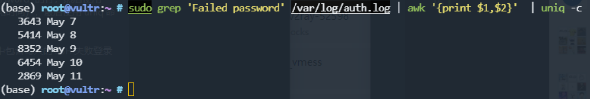
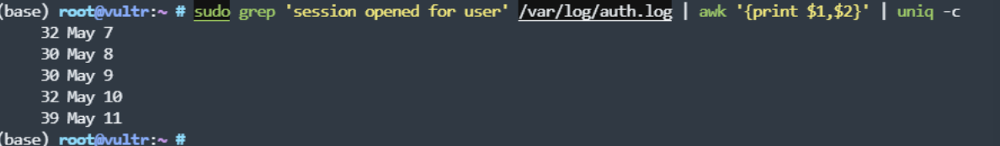

# 关于 SSH 攻击

- 参考 [实录：公有云环境碰上 SSH 攻击的盛况](https://www.v2ex.com/t/939018)

## 查看登录失败次数

```bash
# 查看登录失败 （尝试攻击的情况）
sudo grep 'Failed password' /var/log/auth.log | awk '{print $1,$2}'  | uniq -c
# 查看登录成功的情况
sudo grep 'session opened for user' /var/log/auth.log | awk '{print $1,$2}' | uniq -c
```

## 实况

基本上时时刻刻有人在尝试登陆，前天 8k 多次失败访问。



可怕的来了，登陆成功的情况也很多。



## 尝试解决

- 开 file2ban 应该问题不大
- 开的机器用户名默认不是 root，登录也只能通过 ssh key

## 想法

- 做个脚本跑个定时任务，当 `尝试次数过多` 或者 `登录次数过多` 的时候就发个邮件过来提醒。
