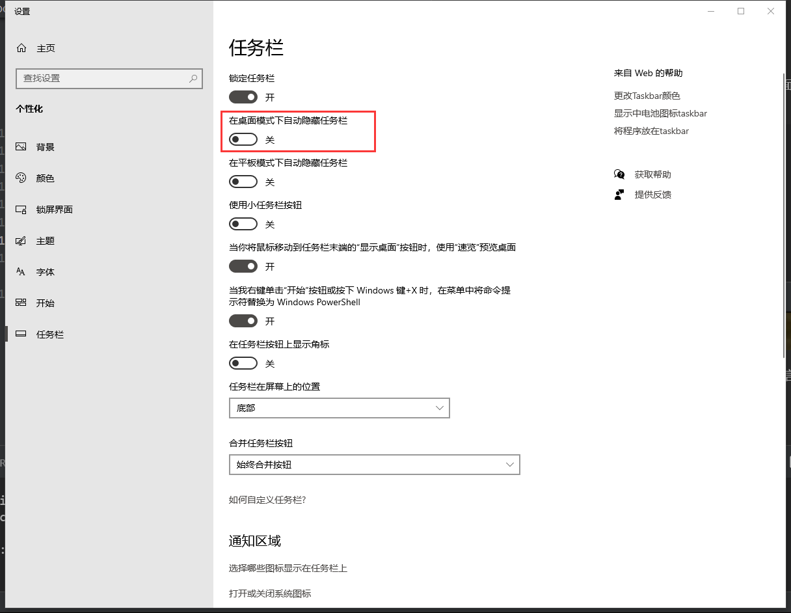

# 关于专注上班

上班总爱划水，得思考解决方案。

## 微信

当水友们想认真上班的时候
分享几个不用退群的几个小技巧：

### 1.放弃电脑端微信 改用手机登录


### 2.把微信藏到隐藏图标里

藏起来就想不到啦


### 3.把任务栏隐藏，进入专注模式

鼠标帖到任务栏就出来了，问题是钉钉也看不到了。



### 4.把任务栏放到不常见的位置

如图把任务栏放到不容易看见的地方，就很少会注意到期动态。


退群了该看微信还是会看微信，重复，**退群了该看微信还是会微信的**，与群聊无关。

同时，即算关了聊天，看知乎，v2ex，或者逛github，都会是另一个角度的“微信”。

本质上还是想放松一下（虽然多资讯会带来更多的决策负担，最好的方法还是啥也不做去放松）。

既然大脑想休息，建议是和读书一样，设定上下课时间，穿插休息时间，建议用番茄时间去管理自己。

## 专注工具

### 番茄时间

优缺点可以看看[参考](https://www.zhihu.com/question/20390242)

* 推荐那种到时间了会锁定屏幕的软件
* Ubuntu推荐[a pomodoro timer for gnome](https://gnomepomodoro.org/)
* Windows直接用自带的**闹钟和时钟**，真香。
* Windows推荐[一个番茄钟](https://www.microsoft.com/store/productId/9NXPDP9GG880),也有[github](https://github.com/DinoChan/OnePomodoro)，用起来一般般，界面酷炫，但是我本身只需要到时间提醒的功能。

欢迎大佬们推荐一些好用的软件。


---

再讲讲下午太长的问题

```txt
A:下午好长。。。
B:番茄时间咯
B:坐25分钟（摸鱼or工作） 站5分钟（上个厕所喝杯水）
B:三个循环后有15分钟的找同事聊天时间
B:四五个循环就差不多要下班了
B:这样下午就不漫长了
A:工作太紧
B:人不是机器
B:不能可专注一下午
B:会坏掉的
```
