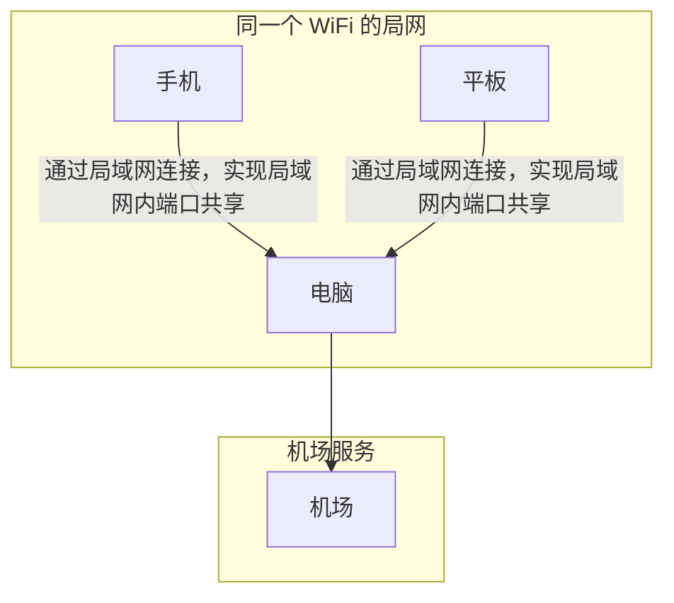
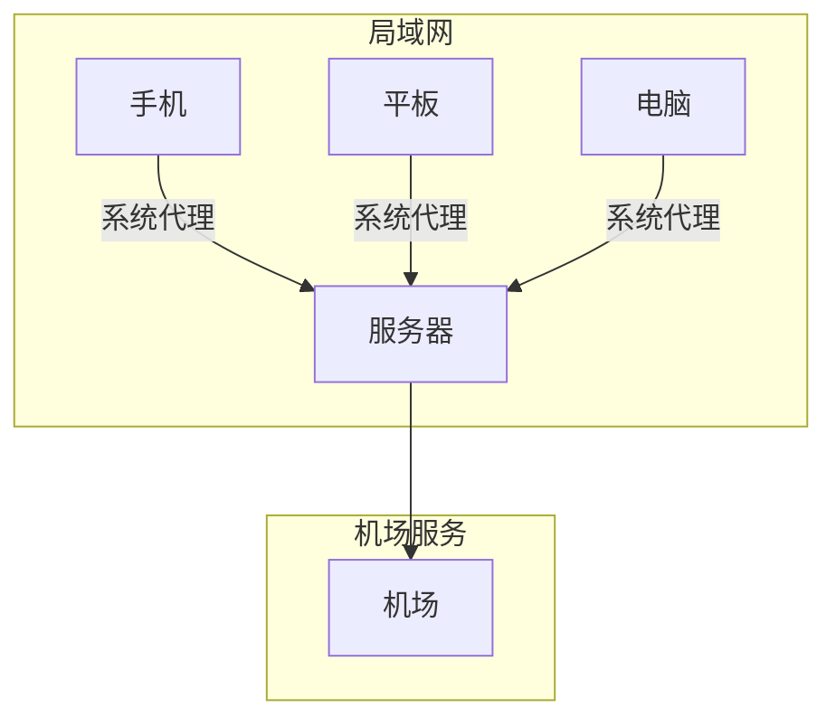
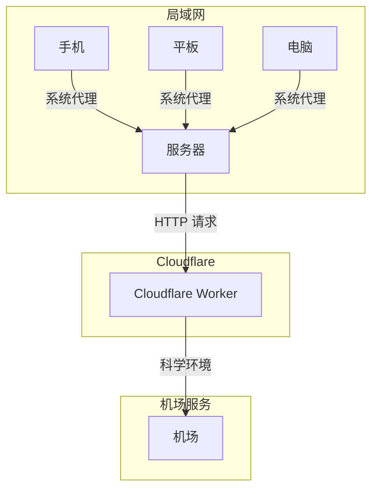

# 关于更新 Clash 的订阅文件

- 本文记录了为解决 Clash 订阅更新问题所进行的一系列尝试和最终实现的自动化方案。
- 主要目标是克服订阅链接中 token 频繁变化带来的不便，并最终实现近乎全自动化的 Clash 订阅更新。

## 背景与痛点 🤔

- 使用某机场提供的 Clash 订阅服务，该服务通过订阅链接提供配置信息。
- 需要在手机、电脑和服务器上使用 Clash。
- 订阅链接中的 token 会定期更新，每次都需要手动更新所有设备的配置，令人苦不堪言 😫。

- 核心需求：
  - 实现多设备共享 Clash 配置。
  - **终极目标：** 尽可能减少手动操作，实现全自动更新。

## 初始方案与架构

### 1. 局域网共享 （临时方案） 🔗

- 最初，为了在手机上使用 Clash，利用电脑作为中转。
- 电脑运行 Clash 后，手机通过局域网连接到电脑的 Clash 端口。
- 再由电脑代理流量。



- **问题：** 电脑需要保持开机状态，关机了，手机也没网了。**自动化程度：低**。

### 2. 引入服务器 🖥️

- 为了更稳定地使用，在服务器上部署了 Clash for Linux。
- 所有设备都可以通过系统代理连接到服务器上的 Clash，再由服务器连接到机场。
- 小服务器 24 小时在线~



- **问题：**
  - 仍然需要手动更新所有设备的 Clash 配置。
  - 小服务定时脚本更新 Clash Docker，但无法应对订阅链接的变动。
  - 还需要手动重启 Docker。
  - **自动化程度：中**（服务器 Clash 更新）。

## 解决 Token 动态变化：Cloudflare Worker 的尝试与转向 ☁️

- 有了 Cloudflare 能解决本地网络访问不到的问题

- 使用预设的固定 token 替换请求中的 token 参数，
  - 不妨碍其他小伙伴使用这个服务。
- 并修改 Clash 配置文件的部分内容。
- 在编写 Cloudflare Worker 脚本的时候就想过包括登录，
  - 但是碰到了 [ja3](https://engineering.salesforce.com/tls-fingerprinting-with-ja3-and-ja3s-247362855967/) 指纹的问题，
  - 所以放弃，这个东西用 Python 也很难解决。

**Cloudflare Worker 的主要功能：**

- 接收客户端发出的订阅请求，避免客户端访问不到机场的问题。
- 如果是特定的 key 请求，则将其替换为预设的 token，减少多端改动。
- 修改从机场获取的 Clash 配置文件内容，例如：
  - 设置 `interval` 为 `180` 秒，提高更新频率。
  - 添加 `tolerance: 2000`，增强更新的稳定性。
- 伪装 `User-Agent`，避免订阅接口的拦截。
- 将修改后的 Clash 配置文件返回给客户端。

**Cloudflare Worker 脚本：**

```js
export default {
    async fetch(request, env, ctx) {
        const url = new URL(request.url);
        var { pathname, search } = url;
        if (search === "?token=KEYTOKEN") {
            search = "?token=ASpecialToken";
        }

        const base_url = `https://bbb.aaa.com/api/v1/client/subscribe${search}`;
        const modifiedHeaders = new Headers(request.headers);
        modifiedHeaders.set('User-Agent', 'ClashForWindows/0.15.10');
        const modifiedRequest = new Request(request, { headers: modifiedHeaders });

        const image_response = await fetch(base_url, modifiedRequest);
        const body = await image_response.text();
        const modifiedYaml = body.replace(/(interval:)\s*\d+/g, '$1 180');
        const modifiedYamlWithTolerance = body.replace(/(interval: 180)/g, '$1, tolerance: 2000');

        return new Response(modifiedYamlWithTolerance, {
            status: image_response.status,
            statusText: image_response.statusText,
            headers: image_response.headers,
        });
    },
};
```

**优势：**

- 无需在客户端设备上直接配置机场订阅链接。
- 只需更新 Worker 上的 token 即可同步所有设备的配置。
- 隐藏了真实的订阅链接，提高了隐私性。

**不足：**

- 仍然需要手动获取最新的有效 token 并更新到 Worker。
- 还必须手动执行以下操作来完成整个更新流程：
  - 打开网页
  - 登录
  - 获取 token
  - 打开 Cloudflare 网站
  - ⭐ 等待 Cloudflare 加载
  - 更新 token
  - 打开 ssh 软件 tabby
  - 连接到 Linux 服务器。
  - 输入 运行脚本的命令
  - 输入 sudo 密码
  - 关闭 SSH 软件
- 好麻烦 😫 **自动化程度：低**（Token 更新）。

## 自动化获取 Token：Selenium 的应用 ⚙️

- 为了自动化获取最新的 token，
- 编写了一个 Python 脚本，
- 使用 Selenium 模拟浏览器登录机场并提取包含 token 的订阅链接。
- 通过 Cloudflare API 更新 Worker 的环境变量
- 最后通过 SSH 连接到服务器，重启 Docker 服务。
- **能自动一点是一点** 👍

**遇到的小问题：**

- **ChromeDriver 重启后需要重新下载，且下载慢**

**缓存 ChromeDriver 的 Python 代码：**

```python
def get_selenium_driver(headless=False):
    driver_path = os.path.join(conf.SELENIUM_DRIVER_DOWNLOAD_DIR, "chromedriver.exe")
    move_driver = False
    if os.path.exists(driver_path):
        service = Service(executable_path=driver_path)
    else:
        move_driver = True
        service = None
    user_cookies = os.path.join(
        os.path.expanduser("~"), r"AppData\Local\Google\Chrome\User Data"
    )
    option = webdriver.ChromeOptions()
    option.add_argument("--no-sandbox")
    option.add_argument("--disable-dev-shm-usage")
    option.add_argument("--user-data-dir={}".format(user_cookies))
    if headless:
        option.add_argument("--headless")

    chrom_driver = webdriver.Chrome(options=option, service=service)
    if move_driver:
        shutil.copy2(chrom_driver.service.path, conf.SELENIUM_DRIVER_DOWNLOAD_DIR)
    return chrom_driver
```

## 自动化更新 Cloudflare Worker Token 🔄

- xpath 部分 略过
- 获取到最新的 token 后，需要将其更新到 Cloudflare Worker 的环境变量中。

**遇到的问题：**

- **Cloudflare API 限制：** 
  - Cloudflare 的 HTTP API 无法直接更新 Worker 的环境变量。
  - 要用他们自己的工具 `wrangler` 。
  - `wrangler` 是 Cloudflare 提供的命令行工具，还需要 nodejs。
- **`fnm` 执行问题：**
  - 使用 **FNM** 管理 Node.js 版本。
  - 但直接通过 Python 执行 `fnm exec npx wrangler secret put` 命令更新 token 失败。
  - 好像是环境变量问题。

**解决方案：**

- 直接调用 Node.js 解释器来执行 `wrangler` 命令，从而更新 Worker 的环境变量。

**Python 代码：**

```python
def update_cloudflare_worker_env(token):
    api_token = os.environ["CLOUDFLARE_API_TOKEN"]
    script_name = os.environ["script_name"]
    env_name = os.environ["env_name"]
    node_exe = os.environ["node_exe"]  # where.exe node
    wrangler_path = os.environ["wrangler_path"]  # 安装 wrangler 后在当前目录下 找 wrangler.js
    os.environ["CLOUDFLARE_API_TOKEN"] = api_token
    command = f"echo {token} | {node_exe} {wrangler_path} secret put {env_name} --name {script_name}"
    result = subprocess.run(command, shell=True, capture_output=True, text=True, encoding="utf-8")
    print("Delete Output:", result.stdout)
    if result.stderr:
        print("Error:", result.stderr)
```

## 自动化更新 Clash 配置并重启服务 🛠️

- 最后一步是在服务器上自动更新 Clash 的配置文件并重启 Clash 服务。编写了一个 `update.sh` 脚本来完成这些操作。

- **遇到的问题：`sudo` 权限**
- 执行 `update.sh` 脚本需要 `sudo` 权限，使用 `paramiko` 库通过 SSH 连接到服务器并执行带 `sudo` 权限的命令。
  - [参考](https://stackoverflow.com/a/28011922)

**Python 代码：**

```python
def run_restart_sh():
    command = "sudo bash /home/root/server/update.sh "
    l_password = os.environ["server_passwd"]
    l_host = os.environ["server_ip"]
    l_user = os.environ["server_username"]
    ssh = paramiko.SSHClient()
    ssh.set_missing_host_key_policy(paramiko.AutoAddPolicy())
    ssh.connect(l_host, username=l_user, password=l_password)
    transport = ssh.get_transport()
    session = transport.open_session()
    session.set_combine_stderr(True)
    session.get_pty()
    session.exec_command(f"{command}")
    stdin = session.makefile("wb", -1)
    stdout = session.makefile("rb", -1)
    stdin.write(l_password + "\n")
    stdin.flush()

    for line in stdout.read().decode("utf-8").splitlines():
        print(f"host: {l_host}: {line}")
    ssh.close()
```

## 总结：自动化升级，解放双手 🎉

- 通过以上步骤，最终实现了一键运行，所有设备都能自动更新 Clash 订阅的操作。
- 虽然当前的方案需要在电脑上运行脚本触发更新，但已经极大地减少了手动操作，提升了用户体验。
- 要是有过 Ja3 和谷歌验证的方案。可以考虑将整个流程部署到服务器上，并设置定时任务。



- ps. ai 画图真的不错。
  - [让我们专注于内容：Markdown 制作幻灯片的三种方案对比](https://sspai.com/post/97131)
- pps. 让 ai 改文章的时间比写代码都长。
