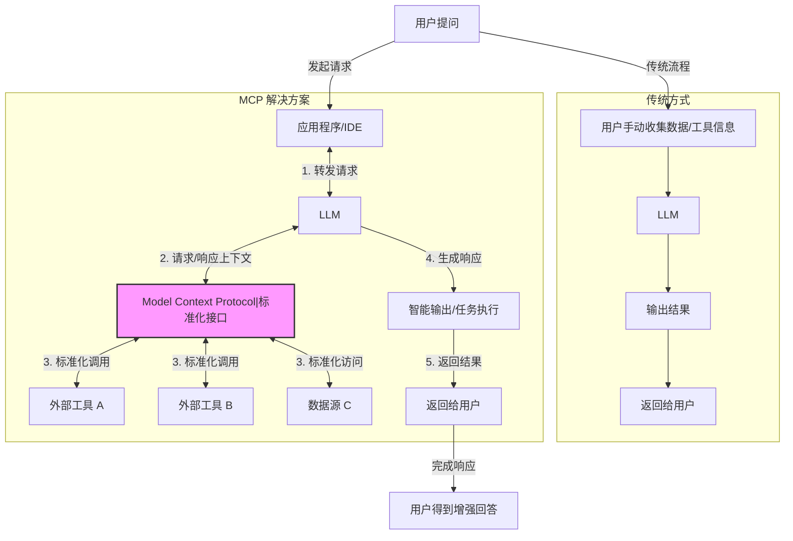

# 关于模型上下文协议 MCP

大型语言模型 (LLM) 很强大，但与外部数据和工具交互不便。模型上下文协议 (MCP) 旨在解决此问题，让 AI 从“解答者”变为“执行者”。本文是 MCP 的快速入门笔记。

## 参考

- [Model Context Protocol (MCP) 快速开始 | Mengke's blog](https://www.mengke.me/blog/202503/MCP_Quick_Start)
- [awesome-mcp-servers](https://github.com/punkpeye/awesome-mcp-servers)
- [从零开始：如何在 Cursor 中集成 GitHub MCP Server](https://blog.csdn.net/fist1881853/article/details/146767976)
- [MCP.so](https://mcp.so/zh): 发现优秀的 MCP 服务器 和客户端

## MCP 解决了啥痛点？ 🤔

- **传统痛点：**

  - LLM 无法感知实时数据、操作外部工具。
  - 手动为 LLM 准备上下文，效率低，自动化程度差。
  - 不同 LLM 平台的 Function Calling 实现不兼容。
- **MCP 方案：**
  - MCP 提供标准接口（像 AI 的“USB-C”），让应用和 LLM 标准化地交换上下文（数据与工具调用）。

- **图解 MCP**



- MCP 使 LLM 能按需、安全、灵活地使用外部工具和数据。

## 快速上手 MCP：Github MCP 示例 🚀

以孟哥博客中 Github MCP + Cursor (AI IDE) 为例：

- **Github 令牌 🔑**
- 路径：Github -\> Settings -\> Developer settings -\> Personal access tokens -\> Tokens (classic).
- 权限：授予 `repo` 和 `workflow`。
- **注意**: 妥善保管 Token。

- **配置 MCP 服务器 (Cursor) ⚙️**
  - 找到应用的 MCP 配置文件 （如 `.mcp/config.json`)。
  - 将 Github Access Token 添加进去。

  - *示例配置：*

  ```json
  {
    "inputs": [
      {
        "type": "promptString",
        "id": "github_token",
        "description": "GitHub Personal Access Token",
        "password": true
      }
    ],
    "servers": {
    "GitHub": {
        "command": "npx",
        "args": [
          "-y",
          "@modelcontextprotocol/server-github"
        ],
        "env": {
          "GITHUB_PERSONAL_ACCESS_TOKEN": "${input:github_token}"
        }
      }
    }
  }
  ```

- **验证与使用 🗣️**
  - 重启应用 （如 Cursor)，检查 MCP 连接状态。
  - 成功后，即可用自然语言操作代码库。例如：“总结 `feature-xyz` 分支的提交”。
  - 测试问题：查找 我 github 上  crawler-utils 项目 下有什么内容

## 报错

### Connection state: Error spawn npx ENOENT

- 参考 https://github.com/cline/cline/issues/1948

```json
{
  // 💡 Inputs are prompted on first server start, then stored securely by VS Code.
  "inputs": [
    {
      "type": "promptString",
      "id": "perplexity-key",
      "description": "Perplexity API Key",
      "password": true
    }
  ],
  "servers": {
    // https://github.com/ppl-ai/modelcontextprotocol/
    "Perplexity": {
      "type": "stdio",
      "command": "npx",
      "args": ["-y", "server-perplexity-ask"],
      "env": {
        "PERPLEXITY_API_KEY": "${input:perplexity-key}"
      }
    }
  }
}
```

- 本地启动不报错 npx -y @modelcontextprotocol/server-github

```log
2025-05-15 17:59:37.349 [info] Connection state: Starting
2025-05-15 17:59:37.354 [info] Starting server from LocalProcess extension host
2025-05-15 17:59:37.366 [info] Connection state: Starting
2025-05-15 17:59:37.366 [info] Connection state: Error spawn npx ENOENT
```

- 改成

```json
{  
  "servers": {
    "github": {
      "command": "cmd",
      "args": ["/c","npx","-y", "@modelcontextprotocol/server-github"],
      "env": {
        "GITHUB_PERSONAL_ACCESS_TOKEN": "${input:github_token}"
      }
    }
  }
}
```

### 报错 Server exited before responding to `initialize` request

```log
2025-05-15 18:02:47.180 [info] Connection state: Running
2025-05-15 18:02:47.196 [warning] [server stderr] 'npx' �����ڲ����ⲿ���Ҳ���ǿ����еij���
2025-05-15 18:02:47.196 [warning] [server stderr] ���������ļ���
2025-05-15 18:02:47.200 [info] Connection state: Error Process exited with code 1
2025-05-15 18:02:47.200 [error] Server exited before responding to `initialize` request.
```

- 首先直接搜搜不到结果
- 然后本地启动也没问题
- 然后想尝试看看错误日志是什么
  - 应该是 GBK 编码
  - 但是输出的时候应该已经丢失内容了
  - 在 `C:\Users\z\AppData\Roaming\Code\logs\20250515T181527\window1` 下也不能看到原内容
- 在 Trae 上有直接的 MCP 市场，可以直接配置成功，就放弃了
  - 等别人出现同样的问题把
