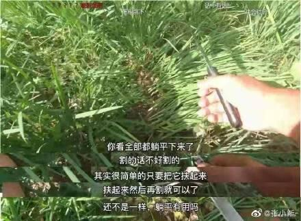

# 后台项目工作的思路整理

随便写写

## 1. 监控与错误报警

1. 普罗米修斯监控响应速率 由运维管理  grafana
2. sentry 收集报错日志 保存错误触发条件 并报警
3. traceback_with_variables 在日志中打印完备触发条件
4. traceback.format_exc() 打印错误栈

## 2. 跟踪调试

1. pysnooper 打印每一步
2. IPython.embed 直接打开命令

## 3. 开发环境完备

1. CI\CD 托管测试发布上线 节约时间
2. PYPI 托管包
3. versioneer 用 git tag 管理包版本
4. pip-tools requirements 管理
5. Git-hook 提交时单元测试检查

## 4. 偷懒

1. cookiecutter 建立项目 单元测试 版本管理一步到位
2. docker 自己弄个全家桶 pypi jenkins grafana sentry mongo redis mysql 一步到胃 # todo
3. 弄个项目做为自己的脚本集入口

## 5. 项目结构问题

建议直接使用 [cookiecutter](https://github.com/AngusWG/cookiecutter-py-package.git)

1. 项目名中划线 包名下划线 避免环境疑难杂症
1. models 文件夹 数据结构+数据库+对象行为
1. views/apis 文件夹 视图相关只管接口
1. env.py 定义基础组件
1. config.py 配置管理

## 6.python 代码检查

Linting

* PyCharm 需要修改格式化
`jetbrains://Python/settings?name=Editor--Code+Style--Python`
Continuation indent = 4

``` yaml
flake8 # 代码检查
flake8-black # black 风格检查
flake8-import-order # import-order(isort)check
flake8-bandit # 安全代码
flake8-annotations # 函数注释检查
flake8-builtins # python builtins 是否被变量名占用
flake8-variables-names # 变量名可读性检查
flake8-functions # 函数检查 长度+参数长度+返回值长度
flake8-expression-complexity # 函数复杂性检查（层数）

# not use
flake8-bugbear # For Flake8 finding likely bugs and design problems in your program.
```


