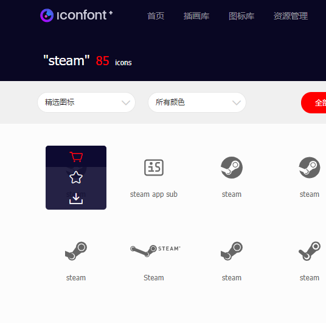
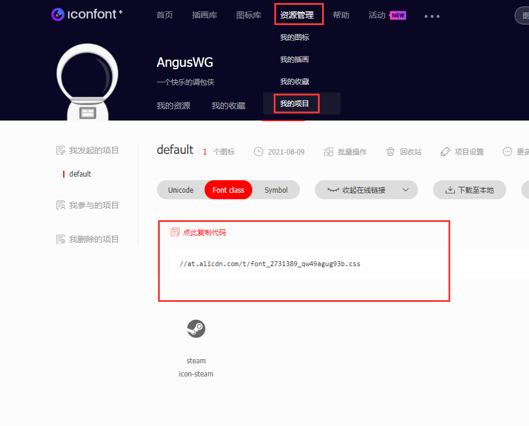

# 在线引入阿里巴巴矢量图标库

- [参考](https://blog.csdn.net/wsl9420/article/details/106724841)

博客想加个 steam 连接，但是没有 logo。找了半天终于找到配置方案，记录一下。

首先要找到一个叫 iconfontCssFile 的配置，知道可以引用在线的 css。

然后进 [https://www.iconfont.cn/](https://www.iconfont.cn/) 搜 steam 找到自己想要的图片
点击购物车图标添加至购物车。

右上角**购物车**添加至**项目**，没有就自己创建一个项目。

添加后就可以在项目中生成在线地址了。

好了，通过 vdooing 的配置已经加上 steam 连接了。

