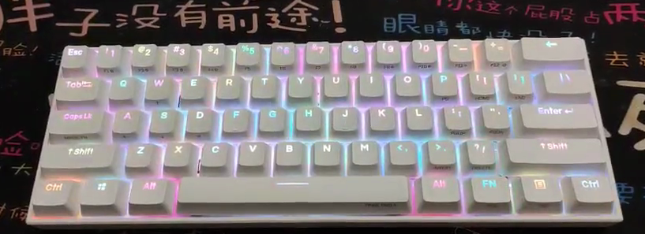

# 好物分享  

自己喜欢啥，总要一遍一遍和朋友介绍，感觉比较麻烦，这样汇总一下，方便朋友一次性安利。  

ps. 每个工具其实在 B 站都有视屏科普，大佬们也可以上 B 站看看。  

## 硬件  

### 键盘： Anne pro 2

> 
>
> - 全键自定义
> - tap key: 支持轻触方向键  
> - magic key: CaspLk 也可以自定义设置为 FN 键  
> - 键盘宏  
> - 自定义 rgb  
> - type-C 充电  
> - USB + 蓝牙双模  
> - 四蓝牙连接  
> - 带电量显示：Fn2 + 8

缺点是没有静音版本，选了红轴默认不按到底，勉勉强强声音不大。  
有个注意点是，当线连接电脑，没关掉蓝牙的话，默认还是蓝牙输入输出，线支持充电。  

---  

### 鼠标：罗技 M590

静音，用电久，自定义鼠标滚轮左右方向，双蓝牙，多设备支持 Logitech Flow，缺点是不好看。  

### 鼠标：罗技 M720  

同上款，自定义按键更多，据说有二三十个。缺点是不静音。  

---  

## 软件  

ps. 本人是全 windows 开发。

### 伪 Linux 系统  

- [Terminus](https://github.com/Eugeny/terminus)
- [WSL2](https://www.jianshu.com/p/908fb231fcce)
- [oh my zsh](https://www.jianshu.com/p/7454e05b8a48)  

wsl2 支持 docker 了，Terminus 配上个炫酷的半透明界面，oh my zsh 自带各种插件好用的哼，一套下来，windows 变 Linux，并且 pycharm 支持基于 wsl 开发，巴适得很。

关于 sz rz 传输 我这里有个 [解决方案](https://www.jianshu.com/p/ed603e6c409c)。  

#### Terminus 需要准备一下

wsl2 默认 root 用户

- `ubuntu config --default-user root`

一个 windows 路径转换脚本，建议放到用户执行目录上，复制的 windows 路劲快速转换为 Linux。

``` python
#!/usr/bin/env python
# encoding: utf-8
# Created by zza on 2021/6/9 14:23
import re

from prompt_toolkit.clipboard import pyperclip

def convert_path():
    path = pyperclip.pyperclip.paste()  # r'/mnt/d/Programs/ActivityWatch'
    wsl_result = re.match(r"(^[A-Z]:)\\(.*)", path)
    if wsl_result:
        _disk_symbol = wsl_result[1][:-1].lower()
        wsl_path = f'\\mnt\\{_disk_symbol}\\{wsl_result[2]}'.replace('\\', '/')
        pyperclip.pyperclip.copy(wsl_path)
        print(wsl_path)
        return wsl_path
    elif re.match(r"^/mnt/([a-z])/(.*)", path):
        win_result = re.match(r"^/mnt/([a-z])/(.*)", path)
        tail = win_result[2].replace("/", "\\")
        win_path = f'{win_result[1].upper()}:\\{tail}'
        pyperclip.pyperclip.copy(win_path)
        print(win_path)
        return win_path
    else:
        print(f'nothing to do with {path}')
        return

if __name__ == '__main__':
    pyperclip.pyperclip.copy('D:\\Programs\\ActivityWatch')
    convert_path()
    print(pyperclip.pyperclip.paste())

```


- 输入一下命令切换剪贴板里的路径，还是很舒服的。

- 之前用的 cmder 感觉还行，但是和 terminus 相比，界面就丑了很多。


---  

### 办公套件 to do list + outlook


待办不管是上班还是平时都用得上。  
[[outlook 支持将邮件自动转入待办]]。  

顺便说一下，outlook 的日历管理也很香。  
  

手机日历上选择 Exchange 导入方式导入日历，就手机端和电脑端同步了。  


---  

### 分屏利器 PowerToys  

  

这个每个 [帖子](https://zhuanlan.zhihu.com/p/166292161) 都讲烂了，自己看把。  

顺便说说 windows 虚拟桌面（部分小伙伴不知道）  

windows + ctrl + d 创建桌面  
windows + ctrl + f4 删除桌面  
windows + ctrl +方向键 快速移动  

好了恭喜你拥有了无数个虚拟桌面。可以给桌面命名，把摸鱼桌面，学习桌面，工作桌面，看板桌面分开。  

### 番茄时钟

google play 搜索 `Tea Time`


- 支持多个定时器同时启动
- 自定义是闹钟还是震动
- 安卓桌面组件，快速启动，支持自定义外观。


---  
