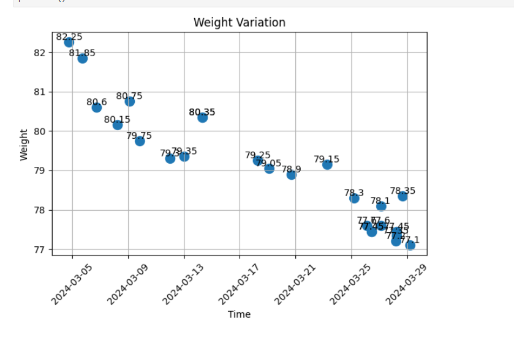

# 小米运动体重导出+作图

## 小米运动数据导出

- [参考](https://jingyan.baidu.com/article/f54ae2fccaaf8a5f93b8490a.html)
- 我的 - 设置 - 账号与安全 - 注销账号 - 导出数据

## 图表体重

- gpt 语句

```text
现在有一个 filepath = './BODY_1711700416591.csv'  数据如下 

time weight height 
2016-02-25 12:51:09+0000 62 null
2016-02-25 12:53:18+0000 64.5 null

怎么用图标查看 weight 的变化
```

---

```python

import pandas as pd
import matplotlib.pyplot as plt
import matplotlib.dates as mdates

# 读取CSV文件
filepath = './BODY_1711700416591.csv'
data = pd.read_csv(filepath)
weight_filter = 50
start_time = "2014-01-01"
end_time = "2025-01-01"

# 将时间列转换为日期时间格式
data['time'] = pd.to_datetime(data['time'])

# 根据时间范围过滤数据
df = data[(data['time'] >= start_time) & (data['time'] <= end_time) & (data['weight'] > weight_filter)]

# 提取"weight"列的数据
weights = df["weight"]

# 设置图表大小
plt.figure(figsize=(12, 6))  # 宽度为12英寸，高度为6英寸
# plt.figure(figsize=(30, 20))  # 宽度为12英寸，高度为6英寸

# # 绘制柱状图，设置线条宽度为最细
# plt.bar(df['time'], weights, linewidth=0.5)

# 绘制折线图
plt.plot(df['time'], weights, marker='o', linestyle='-', linewidth=1)

# # 添加数据标注
# for i, weight in enumerate(weights):
#     plt.annotate(weight, (df['time'].iloc[i], weight), ha='center', va='bottom')

# 设置横坐标刻度间隔为3个月
# plt.gca().xaxis.set_major_locator(mdates.MonthLocator(interval=3))

# 设置纵坐标刻度间隔为5.0
plt.yticks([i for i in range(50, 100, 5)])


# 设置图表标题和标签
plt.xlabel('Time')
plt.ylabel('Weight')
plt.title('Weight Variation')
plt.xticks(rotation=45)
plt.grid(True)

# 设置Weight坐标轴范围
plt.ylim(55, 90)

# 自动调整子图布局，尽可能放大图表
plt.tight_layout()

# 显示图表
plt.show()
plt.savefig('weight_variation.png')
```



---
