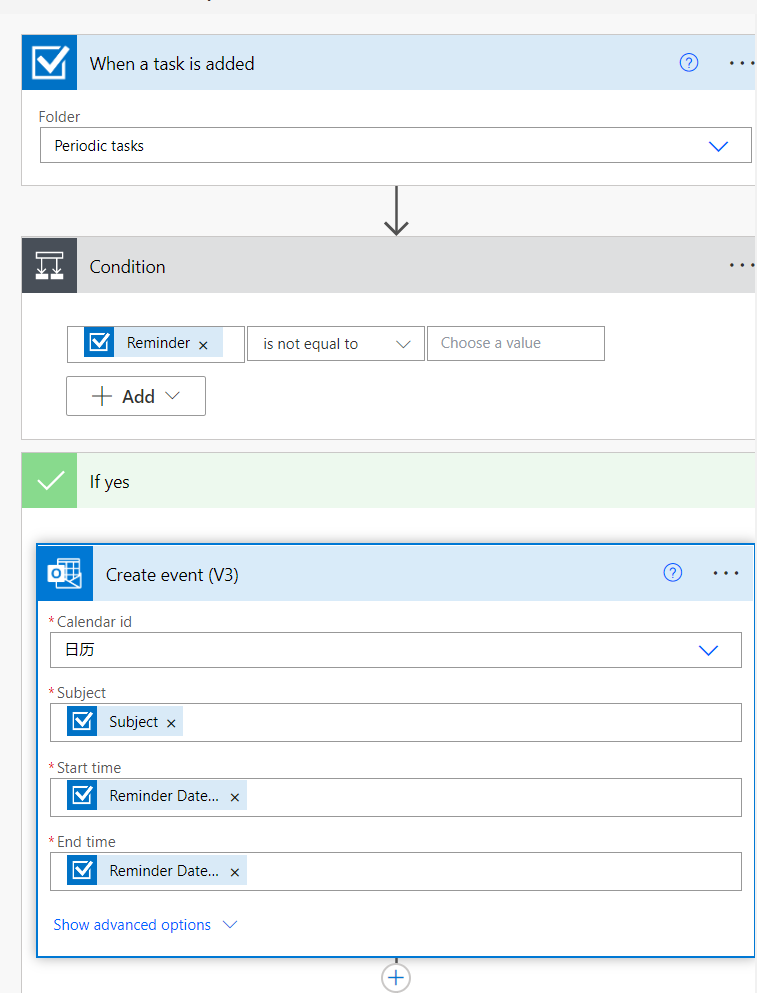
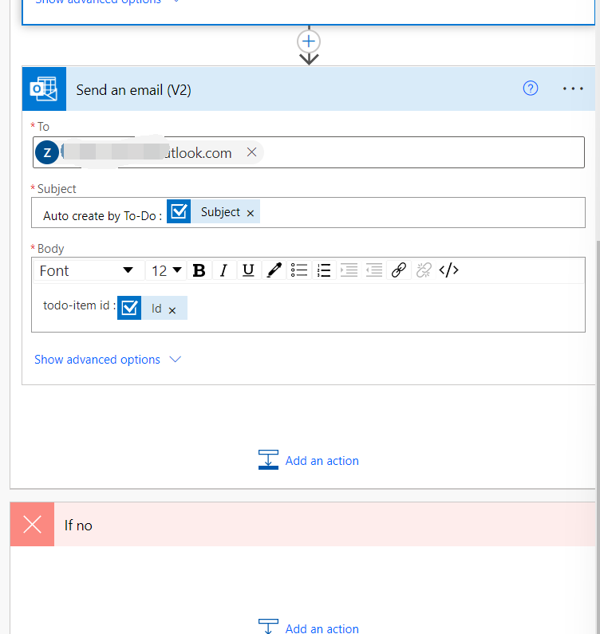
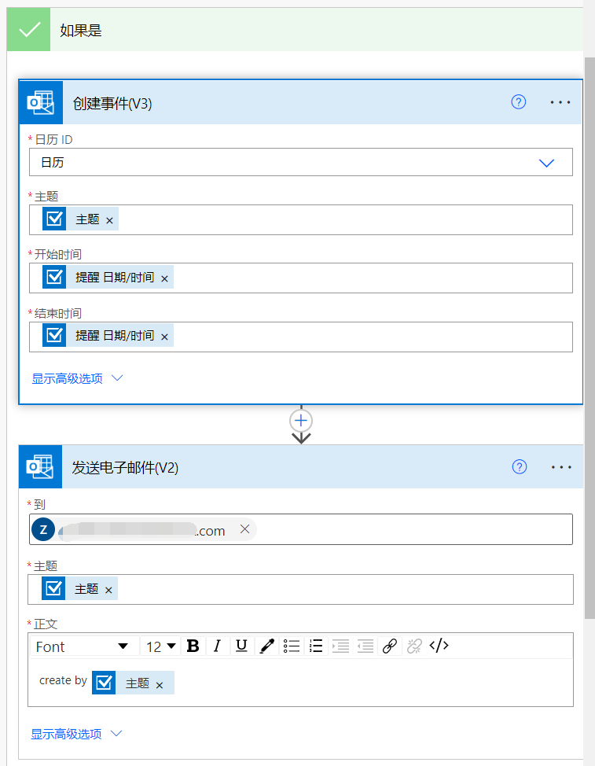

# 待办日历同步

## Microsoft-to-do and Calendar synchronization problem

I use Microsoft-to-do to make a daily plan, but sometimes, I need to check-up if there is free time to give a session or something else. I need my Microsoft-to-do plan will show in Outlook.com's Calendar. Make a better way to me view my schedule.

我使用 Microsoft to do 来制定每日计划，但有时，我需要检查是否有空闲时间进行会议或其他活动。我需要我的 Microsoft 待办计划将显示在 Outlook.com 的日历。给我一个更好的方法来查看我的时间表。

I use [Power Automate](https://us.flow.microsoft.com) to make a action for create event when I made item at Microsoft-to-do.
However, we need to write the reminder time when creating the to-do item.

在我创建一个待办时，[Power Automate](https://us.flow.microsoft.com) 会收到通知，并创建一个日历事件。
但是，我们需要在创建待办时，同时写上提醒时间。

## English Step

First click [Power Automate](https://us.flow.microsoft.com) website and login with your Microsoft-account.

- My flows - New flow - Automated cloud flow
  - give the flow a name. eg to-do Calendar sync
  - the triggers use `when a task is add` - Outlook Tasks
  - click create.
- Choses the folder where you will create tasks
- click `New step`
- search `Condition` - Control
  - Reminder | is not equal to | (empty)
- If yes
  - search `Create event (V3)` - Outlook.com
    - Calendar id - your Calendar name
    - Subject - Subject (with a check sign box)
    - Start time - Reminder Date-Time (with a check sign box)
    - End time - Reminder Date-Time (with a check sign box)
  - click `Add action` (if you need email notice)
  - search `Send an email(V2)` - Outlook.com
    - To - your email
    - Subject - Auto create by To-Do : Subject(with a check sign box)
    - Body
      - The context is decide by you.
- If no
  - do nothing
- Save

## 中文步骤

使用 outlook 邮箱账号登录 [Power Automate](https://us.flow.microsoft.com)。

- 我的流 - 新流 - 自动化云端流
  - 随便起个名字
  - 搜索触发器 `在添加任务时` - Outlook Tasks
  - 点击创捷
- 选择你会创建提醒任务的文件夹
- 点击新步骤
- 搜索 `条件` - 控件
  - 提醒时间 | 不等于 | （放着不写）
- 如果是
  - 搜索 `创建事件 (V3)` - Outlook.com
    - 日历 id - 你使用的日历的名字
    - 主题 - 主题 （有个打钩的框的）
    - 开始时间- 提醒日期（有个打钩的框的）
    - 结束时间 -提醒日期（有个打钩的框的）
  - 点击`添加操作`
  - 搜索 `发送电子邮件 (V2)` - Outlook.com
    - 到 - 填自己的邮箱
    - 主题 - 自动创建事件 : 主题（有个打钩的框的）
    - 正文
      - 随便写啦
- 如果不是
  - 不动
- 保存

## Finish

Ok，now，when you create a to-do item with Reminder-date-time，it will be syncing in a few minutes. And send an email to you

好了，现在当你创建一个待办事项，并且有提醒时间的时候，他将会在一段时间内同步到日历上。并在完成后发送一份邮件到你填写的邮箱里。
