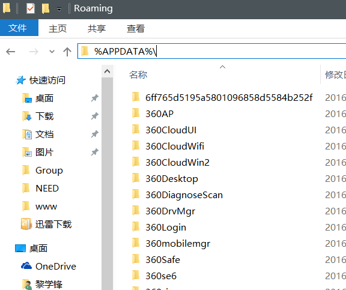
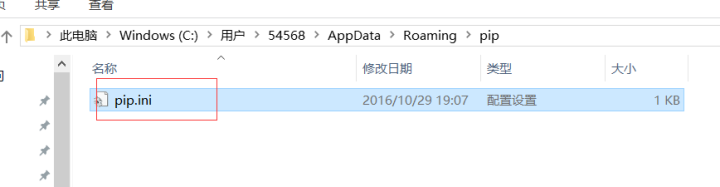

# 用 pycharm 装包出现 pycharm The repository located at pypi douban com is not a

## pycharm The repository located at pypi.douban.com is not a trusted or secure

首先在 window 的文件夹窗口输入 ： %APPDATA%

然后在底下新建 pip 文件夹，然后到 pip 文件夹里面去新建个 pip.ini, 然后再里面输入内容 [global]
timeout = 6000
index-url = http://pypi.douban.com/simple
trusted-host = pypi.douban.com

作者：摘星辰 Li
链接：https://www.zhihu.com/question/38341743/answer/128985546
来源：知乎
