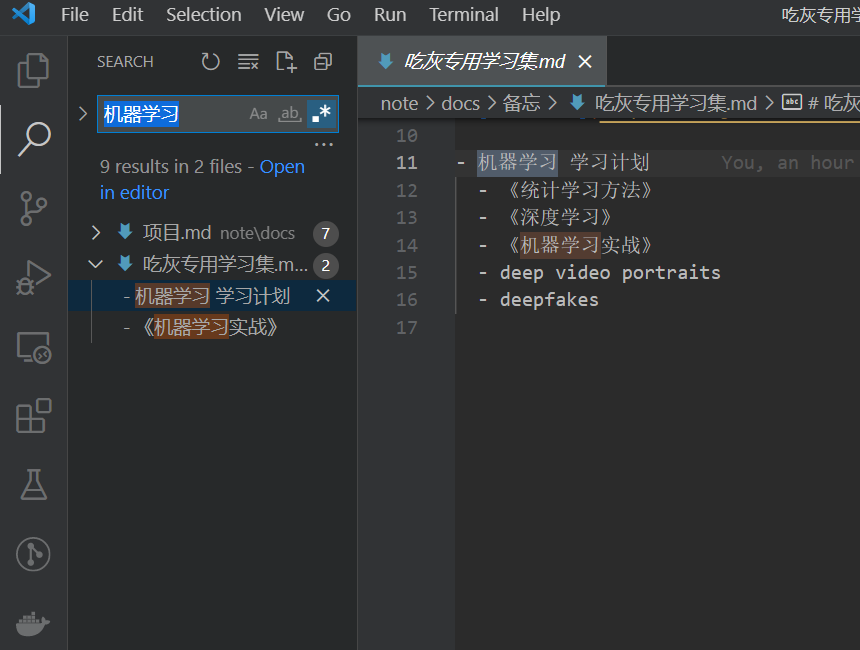
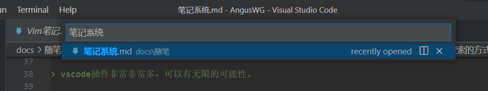

# 笔记系统

~~最近发现其他人的笔记软件和方法都是很系统化的，感觉自己笔记方案需要进一步升级。从老石谈芯第一次听说到到第二大脑的概念，觉得需要更系统的了解一下。感谢`老石谈芯`让我知道啥是`第二大脑`!~~

已经实践**笔记系统**半年左右，抽空回顾下自己的方法论。

## 笔记系统主体程序

我的笔记系统由以下软件构成：

- [Microsoft To Do](https://to-do.microsoft.com/)
  - 待办事项管理
  - 使用可能会有网络问题，请阅读 [[Microsoft-Todo-List 同步异常]]。
- [vs code](https://code.visualstudio.com/)
  - Github Copilot 代码补全
  - vscode 插件非常非常多，可以有无限的可能性。
  - [笔记系统集成部分插件](https://github.com/AngusWG/foam-template-cn/blob/master/.vscode/extensions.json)
  - [自带关键字模板与文件魔板](#模版问题)
- [anki](https://apps.ankiweb.net/)
  - 使用 [抽认卡](https://zh.wikipedia.org/wiki/%E6%8A%BD%E8%AE%A4%E5%8D%A1) 做知识回顾
- [pagenote](https://pagenote.cn/)
  - 网页阅读笔记插件
- github
  - 利用 github Action 部署你的笔记

> 想用`vscode`做`第二大脑`的小伙伴
>
> 可以根着 [foam 中文项目](https://github.com/AngusWG/foam-template-cn) 这个来配置：
>
> - 需要准备一个 github 帐号
> - 把项目 clone 到本地，然后跟着 README 一步一步来就好了

## GTD

首先我们回顾下 GTD(Get thing Done) 的工作流程：

收集 -> 处理 -> 组织 -> 检查 -> 行动 -> 回顾

### 收集

各种生活 | 学习 | 工作事务 -> 清空大脑

- 稍后阅读
  - 在日常刷手机、b 站、微博的时候，不会把重要的文章**精读**，我的习惯是增加到 Microsoft To Do 中单独一个**待整理事项**列表中，有空整理成阅读待办事项，或者抛弃。
- 集中搜索
  - 搜索目标信息，将有用的资料放到一个 markdown 中，做阅读进度管理与知识总结汇总。

> 从认知的角度讲，高质量的信息输入渠道的建设是优先级很高的事情，但诡异的是，很多人却对此投入甚少，甚至选择性忽视掉。 -- [马大伟-构建高质量的信息输入渠道](https://www.bmpi.dev/self/my-info-input-channel/)

### 处理

筛选出有效的可付诸行动的事务 -> 识别任务

长的文章会用 [[网页笔记插件]] 做笔记，事后导出成 markdown 放入笔记系统备份。
有用的资料也是放到同一个主题的 markdown 文件中保存，也可以用两个方括号 (**[[]]**) 做超链接，绑定两个文件。

`cat ./note/docs/项目/图片转 mp4.md`

``` markdown
---
title: 图片转 mp4
date: 2022-07-26 22:01:49
permalink: /pages/c12b7f3f-d6f1-4a39-abb1-c0fcefc6336d/
tags:
  - 
categories:
  - 
article: false
---

# XX 系统

## 待看视频

- [ ] [b 站视频](bilibili.com/xxx)
- [ ] [知乎帖子 A](zhihu.com/xxx)

## 待研究知识点

- 图像视频转换
  - [[ffmpeg 使用方法]]
  - python 相关的包
    - [xxx](github.com/xxx)
    - aaa

```

### 组织

将事务组织成待办事项/项目/日程表/等待/未来可能做 -> 制定目标

Microsoft todo 中创建一个**每日任务**列表，里面的都是点了重复属性的任务，方便提醒。

> - 每日任务中的项目不一定每天都要做，也可以是'思考要不要做'的项目。
> - 同样每日任务也可以用一个标记表示 markdown 文件，做一个引导跳转。

### 检查

每日检查待办事项清单 -> 提醒自己今日要做的事情

在每日早上，在 Microsoft to Do 我的一天 的感叹号中快速添今日待办。可以很快速的批量添加每日任务。

> 建议弄一个简单的任务作为一天的开始，比如：整理邮箱。

一天结束的时候，我会将 Microsoft to Do 中的待办导出，通过脚本转换成日报存入笔记系统中。
回顾一天的事项。同时不能完成的事情也会写上原因。

### 行动

执行待办任务 -> 集中精力完成任务

建议将行动笔记、遇到的问题、bug 信息等，通通放入笔记系统。方便以后搜索。

### 回顾

每周/月回顾 -> 从人生目标/长期目标/中短期目标/近期目标/当前任务的角度审视目标

- 使用**认抽卡-anki** 作为回顾管理软件，如何导入请参考 [[anki 导入 markdown 文件调研]]。
- 建议定期回顾自己的目标。检查自己现在做的事情与自己的愿景（目标）是否一致，及时修正。

- [愿景](https://www.bmpi.dev/self/build-personal-knowledge-system/#%E4%BF%A1%E6%81%AF%E8%BE%93%E5%85%A5%E7%9A%84%E4%B8%8D%E5%90%8C%E6%B8%A0%E9%81%93%E4%BB%8B%E7%BB%8D)

---


## FQA

### Github Copilot 代码补全

这个项目网上介绍很多，就不多说了，懂得都懂。

参考 V2 上这个帖子：[GitHub Copilot 可以写帮我写中文文章了](https://www.v2ex.com/t/814689)

### 读书笔记导出成文 md 文件

之前是没有意识到读书要做笔记，有非常好的句子或者概念可能会发个微博分享一下。

`不动笔墨不读书`，确实需要系统回顾书本内容，更能转化作者传播的概念。

- 需要阅读软件支持高亮内容和笔记导出。
- 多看阅读支持划线与笔记导出。
- 微信阅读支持划线与笔记导出。
- 后期可能需要脚本统一转换成特定格式至我的笔记系统。

### 文件（文章）目录树管理是按名字排序不是任意排序

通过 Foam 实现跳转，常用文件使用了 foam 提供的 tag 服务，

在 VScode 文件浏览器里有 tag 展示窗口，能非常快的找到自己使用的 tag。

### 贴图考虑要不要弄到谷歌图床上

放弃，万一梯子不好用或者谷歌服务条款变了就 GG。还是决定随着放在项目里随着 git 一起管理。

`vscode - Past images`插件支持相对于项目目录去设置存储图片的位置，找个僻静的角落让图片慢慢堆积把。

### 模版问题

Foam 支持模版，需要手动从 [notion](https://www.notion.so/) 里抄一些有用的模版过来。

vscode-snippets 也支持模版么，同样从 notion 里拿就好了（排版问题多用表情，让文字更加鲜活）。

[vscode-snippets 参考](https://github.com/AngusWG/foam-template-cn/blob/master/.vscode/markdown.code-snippets)

### 看板视图

TODO.md Kanban Board 插件解决，但是还是不是很好用。建议还是一个 markdown 管理长期目标。

目前书籍影视评论还是靠豆瓣去解决。（希望豆瓣能长久运行下去）

### 用搜索的方式去查找内容

比如我想查找机器学习相关的内容，
打开搜索，然后`机器学习`，相关的笔记就会展现了。
不需要通过目录的方式去查找笔记。



如果只想单独搜索文件，可以直接打开命令窗口输入文件名（记得把表示命令的 `>` 去掉）



## 关于第二大脑

我觉得就是`数字化笔记`，让笔记可搜索，互相关联，能追根溯源到文章本身。

做笔记本身需要做到以下内容：加入自己想法、假设写给未来的自己、用自己的话去输出。

网上也有说费曼学习法（Concept 概念、Teach 教给别人、Review 回顾、Simplify 简化），我觉得能简化的话，其实会有一定的误导性，能做到前三点就可以了。

在老石谈芯里的 app 推荐中，我理解到以下几点：

- 把觉得重要的信息（视频，文字）用待办的方式放到有空的时间进行精读。
- 精读的信息需要有划线记录重点，同时能写下自己想法。（需要 app 支持）
- 能导出这些想法到自己的笔记系统中。
- `定期回顾`自己的笔记与想法，像背单词一样，多出现几次才能正真成为自己的东西。（每天邮件回顾三条）

老石用的 instapaper 做稍后阅读管理，提炼出重点信息后，通过 readwise 将高亮导出导入到笔记系统中。并通过 readwise 实现定期回顾。

视屏下面的评论有说这类 app 都得翻墙且付费，慢慢找平替把。

## 总结

- vscode 使用 foam 插件，使得笔记管理更加简单，更加方便。用非目录的图的方式链接的笔记。
- 明确了多看阅读，微信阅读记录导出笔记的阅读方式。
- 万物都可记，在连接数据库和 vscode 本身的搜索能力的帮助下，任何事情都可以记录在‘第二大脑’里。


## 参考资料

- [老石谈芯-Notion 使用技巧分享](https://www.bilibili.com/video/BV1aV411v7te)
- [老石谈芯-第二大脑工作流 App 分享](https://www.bilibili.com/video/BV1db4y1b7w5)
- [马大伟-我的笔记系统](https://www.bmpi.dev/self/note-system/)
- [马大伟-用 OneNote 管理你的知识](https://www.bmpi.dev/self/onenote-intro/)
- [BEN HOLMES - Leaving Notion to build a second brain in VS Code](https://bholmes.dev/blog/giving-up-on-notion-to-build-a-second-brain/)
