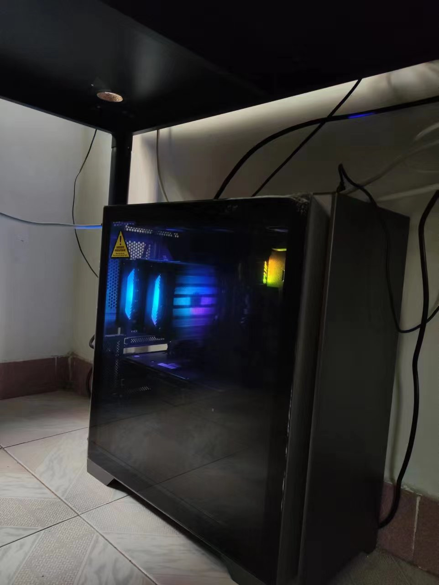
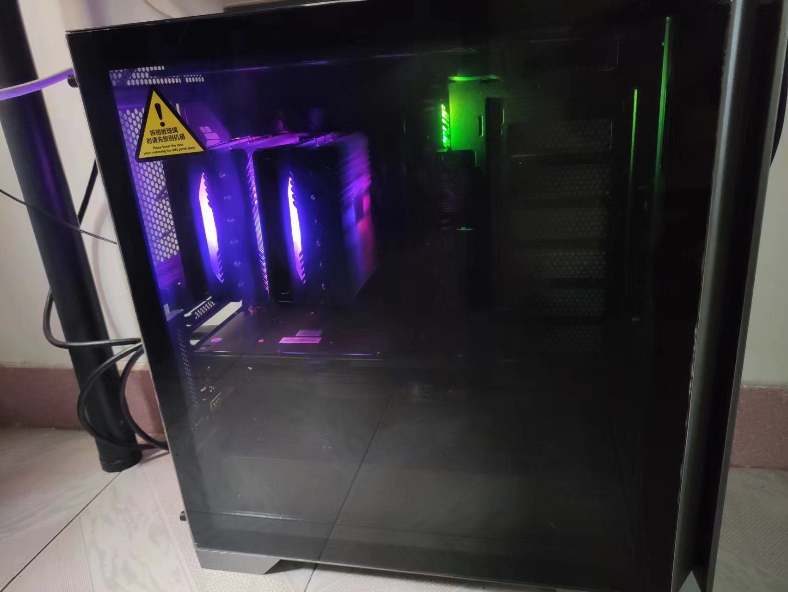

# 组装机配置

- 参考
  - [Gyusang](https://zhuanlan.zhihu.com/p/217881116)
  - [小马哥](https://zhuanlan.zhihu.com/p/574398019)
    - [显卡](https://zhuanlan.zhihu.com/p/269635708)
- 笔记本直接看这个人
  - [夏蒙乾](https://www.zhihu.com/people/xiamengqian)
  - 但是最近（2023-02-09）还是不推荐买，能增加内存、ssd 的机型要么过于贵、要么其他方面不行。

---

## CPU 选择

- [x] CPU
- [x] 主板

- 套餐划算一点
  - [B660M-PLUS + i5-12490F 2388](https://item.jd.com/10003740064.html#crumb-wrap)
  - [B660M-PLUS + i5-12600KF 2849](https://item.jd.com/100018923031.html#crumb-wrap)
  - [B660M-PLUS + i7-12700F 3309](https://item.jd.com/100018923031.html#crumb-wrap)

---

## 总体配置

- CPU+主板 [B660M-PLUS + i7-12700F ￥3109](https://item.jd.com/100018923031.html#crumb-wrap)
  - B660M-PLUS ￥1060
  - i7-12700F ￥2130
  - cpu 65 w
- 散热 利民 PA120 ￥169
  - 光太亮了，不能直视。
- 内存 骇客神条 16g x 2 = ￥1099.00
  - `DDR4 会便宜很多，主板就得换一个（也会便宜很多）`
- 固态 [宏碁 GM7000 1T 649](https://item.jd.com/100027922632.html)
- 电源 酷冷 GX850 ￥594
  - 后期如果要上 3090 还得是千瓦电源
- 机箱 先马（SAMA）颜之神 钛灰色 ￥226
- 风扇 利民 12 厘米风扇 3 个，安装在尾部和顶部 ￥53
  - `声音大`
- 显卡 3070 卡诺基 ￥2199
  - 购买日的前两天涨价了 200 块，`卡诺基`在翻新卡里算口碑不错的。

- 总价 7449

---

## 功率

[最简单粗暴的电源计算办法，把 CPU 和 GPU 的功耗加起来再加上 100W，可以粗略算出配置的整体功耗。】](https://www.zhihu.com/question/517028071)

电源 850w + 100w + 65w (cpu)




## 固态

- 加了个固态
  - [梵想（FANXIANG）S690 SSD 固态硬盘 M.2 接口 (PCIe4.0x4) 2TB【高写入 1400TBW 长江存储晶圆 】](https://item.m.jd.com/product/10067966397160.html?gx=RnFnwmZROmbdn9RP--txC7ThHvUc9D4hxF_J&ad_od=share&utm_source=androidapp&utm_medium=appshare&utm_campaign=t_335139774&utm_term=Wxfriends) 719
    - 网上说有两个情况 看人品吧
      - 掉盘
      - 存入 1300g 左右后 读写速度明显减慢
- 测试方式
  - AS SSD Benchmark
  - CrystalDiskMark
- [Windows 上快速创建一个 1G 以上的大文件](https://blog.csdn.net/ilovezyr/article/details/45598841)
  - fsutil file createnew e:\b.txt 1073741824

## 空盘测试数据

### AS SSD Benchmark

```text


AS SSD Benchmark 2.0.7316.34247
------------------------------
Name: Fanxiang S690 2TB
Firmware: SN07443
Controller: stornvme
Offset: 16384 K - OK
Size: 1863.01 GB
Date: 2023/2/13 11:18:00
------------------------------
Sequential:
------------------------------
Read: 4215.19 MB/s
Write: 3722.04 MB/s
------------------------------
4K:
------------------------------
Read: 79.78 MB/s
Write: 222.97 MB/s
------------------------------
4K-64Threads:
------------------------------
Read: 2091.47 MB/s
Write: 1283.86 MB/s
------------------------------
Access Times:
------------------------------
Read: 0.016 ms
Write: 0.060 ms
------------------------------
Score:
------------------------------
Read: 2593
Write: 1879
Total: 5783
------------------------------
```

### CrystalDiskMark

```text
------------------------------------------------------------------------------
CrystalDiskMark 8.0.1 x64 (C) 2007-2021 hiyohiyo
                                  Crystal Dew World: https://crystalmark.info/
------------------------------------------------------------------------------
* MB/s = 1,000,000 bytes/s [SATA/600 = 600,000,000 bytes/s]
* KB = 1000 bytes, KiB = 1024 bytes

[Read]
  SEQ    1MiB (Q=  8, T= 1):  4858.861 MB/s [   4633.8 IOPS] <  1509.94 us>
  SEQ    1MiB (Q=  1, T= 1):  4486.361 MB/s [   4278.5 IOPS] <   233.60 us>
  RND    4KiB (Q= 32, T= 1):   883.414 MB/s [ 215677.2 IOPS] <   143.61 us>
  RND    4KiB (Q=  1, T= 1):    79.243 MB/s [  19346.4 IOPS] <    51.61 us>

[Write]
  SEQ    1MiB (Q=  8, T= 1):  4467.455 MB/s [   4260.5 IOPS] <  1849.33 us>
  SEQ    1MiB (Q=  1, T= 1):  4459.696 MB/s [   4253.1 IOPS] <   234.96 us>
  RND    4KiB (Q= 32, T= 1):   423.689 MB/s [ 103439.7 IOPS] <   304.18 us>
  RND    4KiB (Q=  1, T= 1):   257.067 MB/s [  62760.5 IOPS] <    15.85 us>

Profile: Default
   Test: 1 GiB (x5) [E: 0% (0/1863GiB)]
   Mode: [Admin]
   Time: Measure 5 sec / Interval 5 sec 
   Date: 2023/02/13 11:28:35
     OS: Windows 10 Professional [10.0 Build 22621] (x64)
```

## 写入 1T+ 数据后

### AS SSD Benchmark 2

```text
AS SSD Benchmark 2.0.7316.34247
------------------------------
Name: Fanxiang S690 2TB
Firmware: SN07443
Controller: stornvme
Offset: 16384 K - OK
Size: 1863.01 GB
Date: 2023/2/14 11:04:19
------------------------------
Sequential:
------------------------------
Read: 4150.81 MB/s
Write: 4084.55 MB/s
------------------------------
4K:
------------------------------
Read: 63.06 MB/s
Write: 204.81 MB/s
------------------------------
4K-64Threads:
------------------------------
Read: 2089.18 MB/s
Write: 1283.93 MB/s
------------------------------
Access Times:
------------------------------
Read: 0.087 ms
Write: 0.071 ms
------------------------------
Score:
------------------------------
Read: 2567
Write: 1897
Total: 5776
------------------------------
```

### CrystalDiskMark 2

```text
------------------------------------------------------------------------------
CrystalDiskMark 8.0.1 x64 (C) 2007-2021 hiyohiyo
                                  Crystal Dew World: https://crystalmark.info/
------------------------------------------------------------------------------
* MB/s = 1,000,000 bytes/s [SATA/600 = 600,000,000 bytes/s]
* KB = 1000 bytes, KiB = 1024 bytes

[Read]
  SEQ    1MiB (Q=  8, T= 1):  4828.908 MB/s [   4605.2 IOPS] <  1728.61 us>
  SEQ    1MiB (Q=  1, T= 1):  4506.055 MB/s [   4297.3 IOPS] <   232.57 us>
  RND    4KiB (Q= 32, T= 1):   808.553 MB/s [ 197400.6 IOPS] <   156.88 us>
  RND    4KiB (Q=  1, T= 1):    71.322 MB/s [  17412.6 IOPS] <    57.27 us>

[Write]
  SEQ    1MiB (Q=  8, T= 1):  4393.255 MB/s [   4189.7 IOPS] <  1906.56 us>
  SEQ    1MiB (Q=  1, T= 1):  4383.751 MB/s [   4180.7 IOPS] <   239.06 us>
  RND    4KiB (Q= 32, T= 1):   405.718 MB/s [  99052.2 IOPS] <   322.86 us>
  RND    4KiB (Q=  1, T= 1):   247.658 MB/s [  60463.4 IOPS] <    16.43 us>

Profile: Default
   Test: 1 GiB (x5) [E: 66% (1226/1863GiB)]
   Mode: [Admin]
   Time: Measure 5 sec / Interval 5 sec 
   Date: 2023/02/14 11:09:57
     OS: Windows 10 Professional [10.0 Build 22621] (x64)

```
