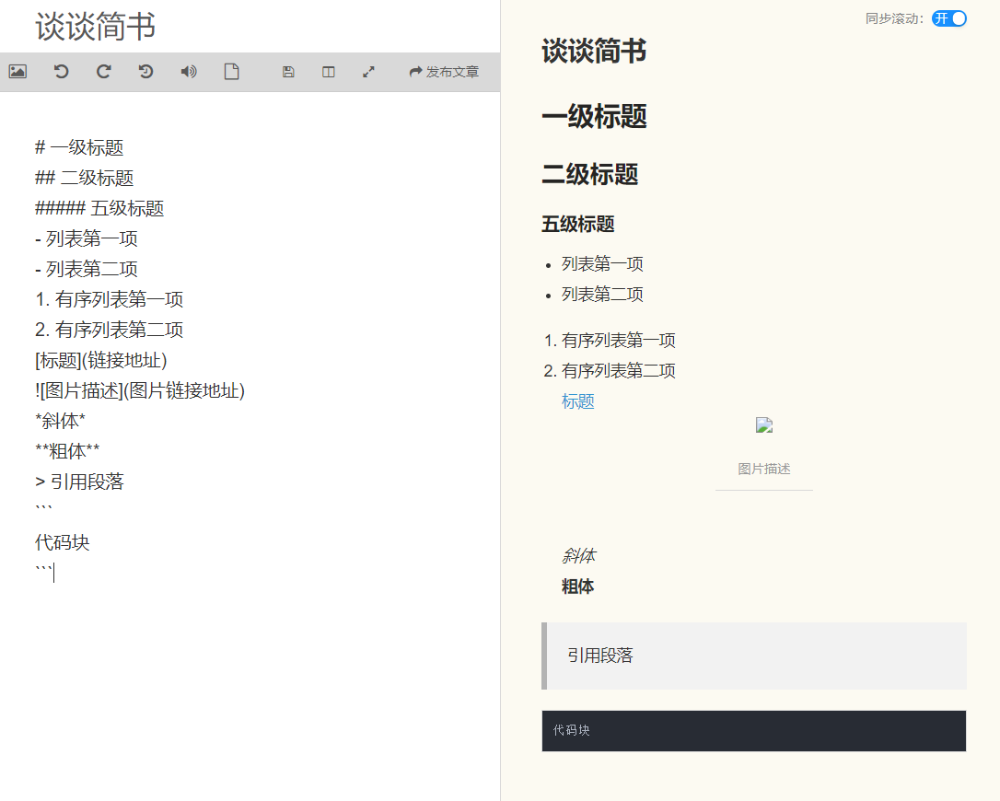
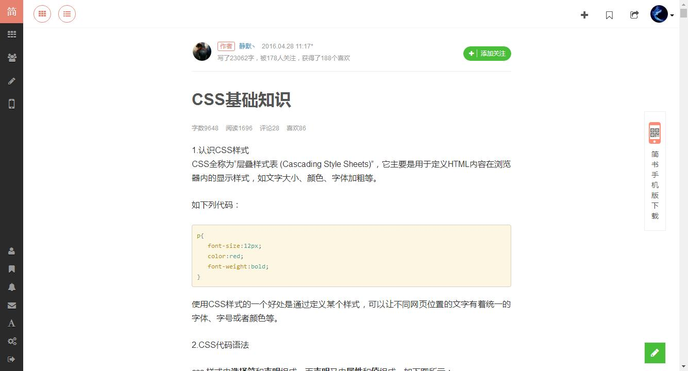
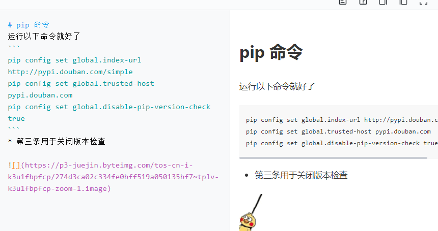

# 谈谈简书

彻底不用简书了，纪念一下。

## 始

一开始我的文章内容是基于简书 (www.jianshu.com)，  
也是因为简书，才喜欢上 markdown 语法。
简书的编辑器有`所见即所得`的 markdown 预览，  
对于初学者就非常的直观。

简书实时保存很迅速，  
在多端需要都有编辑（记录）的情况下，  
右上角的按钮会实时显示成保存中，  
每次保存都有历史记录，  
给人非常安心的感觉。

老版本的简书文章界面非常的简洁，  
隐隐有点苹果的高级质感，  
现存版本的简书文章旁边都是广告，眼花缭乱。

---

## 终

营销文章占领平台，随着简书做大了，  
很多机器人从 csdn 搬到了简书上，  
但是对我单纯放内容的人而言，问题不大。

一次明星引战引到简书，简书开始了质量审查。  
“我们”有种特性，上头传达命令时，说 10 分，下头的人做事，得要求 12 分。  
于是乎简书的审查非常非常严，技术文章稍微沾点边就会锁定，哪怕以前的老文章也会被锁定。

再后面简书搜索功能关闭，至今（2021-05-17）未开。

感觉到简书离凉不久了，于是全部搬运到 github 上，  
确实部分还未完成发表的文章放私有仓库编辑，再贴过来不方便，  
但是胜过审查不严格，技术讨论自由。

## 然

* 掘金

偶尔试过掘金的编辑。  
掘金的文章质量目前来看还是很好，  
再一个文章编辑带色彩，目前来看比简书要舒服很多。  
但是考虑到万一哪天突然有了敏感词，  
所以还是换本地 github 来的舒服。  

* OneNote

已经用了 outlook + Microsoft todo。  
也想着用 OneNote 去做笔记及文章发表，  
但是最新版的对 markdown 并不友好，且国内同步是个很大的问题。  
所以还是选择了当前的方案。  

## 已

最终还是 vs code 的方案去写，也开始尝试接触 Vue 的框架去弄 blog。
未完成的写在 github 私有项目里，写完了的文章复制过来。
用了几个插件，保证舒适度，感谢插件开发者的贡献。

* Markdown All in One # markdown 基本需要都在里面了
* Note Sync  # 实时同步到 github 上，建议配置 dev 分支，写好了 merge 一下。
* Mermaid Markdown Syntax Highlighting # 画图专用
* Marp for VS Code # markdown to PPT

目前用于写博客还挺舒服的。

---

今天把简书的内容全部搬过来，简书彻底废弃，特此纪念一下。

