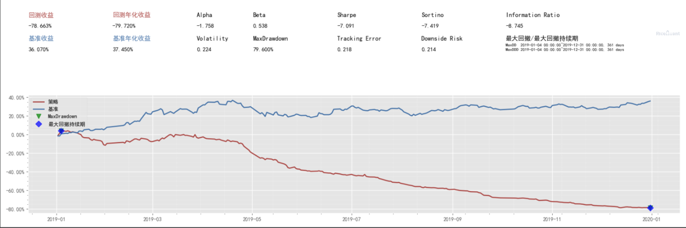
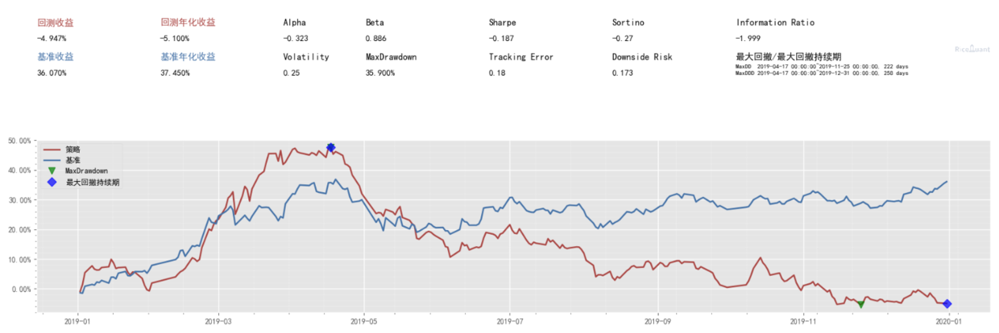
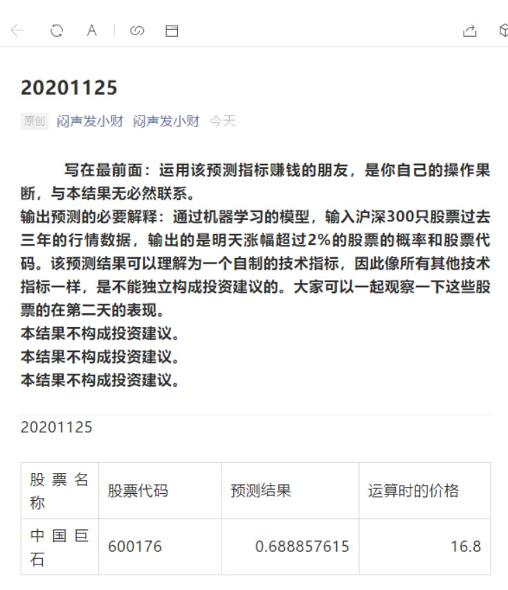

# 韭菜的股市研究  

## 写在前面的话

* 通过 [米筐](https://www.ricequant.com) 网站提供的量化平台进行的测试。
* 做这个研究的初衷是笔者有一点意象投资股市，有几个不同的投资方案（策略），我想先拿 19 年的数据跑一跑我的方案（策略），如果亏钱了，就不玩股市，老老实实玩基金了。


---

## 关于如何读这个图


* 首先能看到时间，我的数据是从`2019 年 01 -- 2020 年 01`,
* 红色的线代表账户市值（把股票持仓也换算成钱）的变化。
* 蓝色的线代表基准（沪深三百）的市值变化。
* 其次最重要的指标，`回测收益`，表示的是我本金到时间结束，涨了多少，比如我有 5w，那么这个图表示我年末结束涨到了 `5*(0.09+1) = 5.45（万元）`。
* 然后平均一年能有 13.5%的收益。
* 然后看`基准收益`, 这个我一般设置的是沪深三百，也就是大盘，这个图表示 19 年大盘涨了`30+%`，而我的策略只有`9+%`，其实是没有跑赢大盘的 (*还不如买基金*)。
* 然后需要注意下一个指标"MaxDrawdown（最大回测）": 最大回撤是最常用的指标，描述了投资者可能面临的最大亏损。最大回撤的数值越小越好，越大说明风险越大。
* Sharpe（夏普率）：夏普比率若为正值，代表基金报酬率大于风险；若为负值，代表基金风险大于报酬率。因此，夏普比率越高，投资组合越佳。

好了，下面开始正文。

---

## 检测低于 x 元的 股票 ，购买并持有 3 个礼拜后抛出

这个是一个普遍的购买思路，觉得底价股票一定会长，我短期持有然后等他高于某个价格就出售，我模拟一下这个情况，下面是代码：

``` python
#!/usr/bin/python3    
# encoding: utf-8     
# @Time    : 2020/11/18 14:32    
# @author  : zza    
# @Email   : 740713651@qq.com    
    
import warnings    
    
import pandas    
import rqdatac    
    
__config__ = {    
    "base": {    
        "start_date": "20190101",    
        "end_date": "20191231",    
        'frequency': '1d',    
        "accounts": {    
            "stock": 5000,    
        }    
    },    
    "mod": {    
        "sys_progress": {    
            "enabled": True,    
            "show": True    
        }, "sys_accounts": {    
            "enabled": True,    
            "dividend_reinvestment": True,    
        },    
        "sys_analyser": {    
            "enabled": True,    
            "plot": True,    
            'benchmark': '000300.XSHG',    
        },    
    }    
}    
    
def init(context):    
    context.lowest = 5    
    context.highest = 5.9    
    context.day_count = 0    
    context.holding_days = 10    
    
def get_ticker(context):    
    all_ins = rqdatac.all_instruments("Stock").order_book_id.to_list()    
    price_df = rqdatac.get_price(all_ins, context.now, context.now, expect_df=True, fields=['close'])    
    price_df = price_df.reset_index(drop=False)    
    price_df = price_df[(context.lowest <= price_df.close) & (price_df.close <= context.highest)]    
    
    start_date = rqdatac.get_previous_trading_date(context.now, 2)    
    price_df_2 = rqdatac.get_price(price_df.order_book_id.to_list(), start_date, context.now, expect_df=True,    
                                   fields=['close']).reset_index(drop=False)    
    order_ticker = []    
    for order_book_id, data_df in price_df_2.groupby(price_df_2.order_book_id):    
        if (data_df.close.shift(fill_value=0) < data_df.close).all():    
            order_ticker.append(order_book_id)    
    
    return order_ticker    
    
def before_trading(context):    
    context.day_count += 1    
    if (context.day_count - 1) % context.holding_days == 0:    
        context.order_ticker = get_ticker(context)    
    
def handle_bar(context, bar_dict):    
    if (context.day_count - 1) % context.holding_days == 0:    
        with warnings.catch_warnings():    
            for item in context.order_ticker:    
                o = order_target_value(item, 1000)    
                if o:    
                    print(o)    
    
    if (context.day_count - 1) % context.holding_days == (context.holding_days-1):    
        for item in context.portfolio.positions.keys():    
            order_target_value(item, 0)    
    
def after_trading(context):    
    print("total_value {}".format(context.portfolio.total_value))    
    if (context.day_count - 1) % 15 == 0:    
        items = []    
        for k, v in context.portfolio.positions.items():    
            items.append({"order_book_id": k, "quantity": v.quantity})    
        print(pandas.DataFrame(items))    
    
if __name__ == '__main__':    
    import rqalpha    
    
    rqalpha.run_func(init=init,    
                     before_trading=before_trading,    
                     handle_bar=handle_bar,    
                     after_trading=after_trading,    
                     config=__config__)    
```

* 持有 3 个交易日


* 持有 10 个交易日


* 持有 15 个交易日


结论：底价股票确实会随着大盘的涨而有一定的波动，但最终都是会赔钱的，且三个交易的日的时候，直接赔钱了。这个图可以给广大读者的保佑侥幸心里的朋友看看，`一年忙到头，不如买国运（沪深三百）。`

---

## 根据公众号 闷声发小财

这个是根据我一个朋友跑的算法跑出来的可能会涨的概率。笔者拿到了他一年的数据（没用爬虫），然后试试能不能涨，这么跑的原因是，我当初确实想按着他的这个公众号来买，不过既然有回放数据测试，我当然先测试一下，本金本来就不多，挥霍不了，不敢随便教学费。



策略如下：

```python
#!/usr/bin/python3    
# encoding: utf-8     
# @Time    : 2020/11/22 16:33    
# @author  : zza    
# @Email   : 740713651@qq.com    
# @File    : 闷声发小财。py    
    
import warnings    
    
import numpy    
import pandas    
import rqdatac    
from rqalpha.apis import *    
    
__config__ = {    
    "base": {    
        "start_date": "20190101",    
        "end_date": "20191231",    
        'frequency': '1d',    
        "accounts": {    
            "stock": 5000,    
        },    
        "data_bundle_path": r"E:\data\bundle",    
    },    
    "extra": {    
        "log_level": "debug",    
    },    
    "mod": {    
        "sys_progress": {    
            "enabled": True,    
            "show": True    
        }, "sys_accounts": {    
            "enabled": True,    
            "dividend_reinvestment": True,    
        },    
        "sys_analyser": {    
            "enabled": True,    
            "plot": True,    
            'benchmark': '000300.XSHG',    
        },    
    },    
}    
    
def init(context):    
    context.df = pandas.read_csv("发小财。csv", dtype={"股票代码": numpy.str})    
    context.df['order_book_id'] = rqdatac.id_convert(context.df["股票代码"].to_list())    
    context.used_df = context.df[context.df["预测结果"] > 0.7]    
    context.sell_multiple = 1.08    
    context.holding_days = 1    
    context.buy_queen = []    
    context.sell_map = {}    
    
def before_trading(context):    
    print("当日购买：{}".format(context.buy_queen))    
    print("当日持仓：{}".format(list(context.sell_map.keys())))    
    
def handle_bar(context, bar_dict):    
    while context.buy_queen:    
        order_book_id = context.buy_queen.pop()    
        if context.stock_account.cash > 1000:    
            o = order_value(order_book_id, 1000)    
            if o:    
                trading_dt = get_next_trading_date(context.now, context.holding_days).to_pydatetime()    
                context.sell_map[order_book_id] = trading_dt    
                print("[{}] 购买成功".format(order_book_id))    
        else:    
            print("[{}] 资金不足，无法购买".format(order_book_id))    
    for order_id, dt in context.sell_map.copy().items():    
        a = dt.date() <= context.now.date()    
        b = bar_dict[order_id].close > get_position(order_id).avg_price # * context.sell_multiple    
        if a and b:    
            o = order_percent(order_id, -1)    
            if o:    
                del context.sell_map[order_id]    
                print("[{}] 卖出成功".format(order_id))    
    
def dt_to_int(dt):    
    return dt.year * 10000 + dt.month * 100 + dt.day    
    
def after_trading(context):    
    df = context.used_df[dt_to_int(context.now) == context.used_df.trading_dt]    
    if df.empty:    
        return    
    else:    
        for _, item in df.iterrows():    
            context.buy_queen.append(item["order_book_id"])    
    
if __name__ == '__main__':    
    import rqalpha    
    
    rqalpha.run_func(init=init,    
                     before_trading=before_trading,    
                     handle_bar=handle_bar,    
                     after_trading=after_trading,    
                     config=__config__)    
    
```

* 持有一天就卖出


* 持有 3 天并价格高于持仓价则卖出


结论：还好跑了回放测试，不然得教好多学费。

---

## 检测行业因子普遍 (90%) 一周内上涨的低价股票

这个也是我在上班的时候偶尔能想到的，我觉得可能也代表一分部分人的想法，**某个行业市场涨幅的时候，必定是全行业性质的，且会持续一段时间。**于是我就写了这个，根据股票行业暴露度（属于哪个行业），分类行业，如果都涨了，就买进，如果都跌了，就卖出。

* 检测行业因子普遍 (90%) 一周内上涨的低价股票 购买并持有
* 在行业下跌在 30% 左右卖出

代码如下：

```python
#!/usr/bin/python3    
# encoding: utf-8     
# @Time    : 2020/11/22 16:33    
# @author  : zza    
# @Email   : 740713651@qq.com    
# @File    : 闷声发小财。py    
from collections import defaultdict    
from pprint import pprint    
    
import numpy    
import pandas    
from rqalpha.apis import *    
    
__config__ = {    
    "base": {    
        "start_date": "20190101",    
        "end_date": "20191231",    
        'frequency': '1d',    
        "accounts": {    
            "stock": 50000,    
        },    
        "data_bundle_path": r"E:\data\bundle",    
    },    
    "extra": {    
        "log_level": "debug",    
    },    
    "mod": {    
        "sys_progress": {    
            "enabled": True,    
            "show": True    
        }, "sys_accounts": {    
            "enabled": True,    
            "dividend_reinvestment": True,    
        },    
        "sys_analyser": {    
            "enabled": True,    
            "plot": True,    
            'benchmark': '000300.XSHG',    
        },    
    },    
}    
    
def get_holding_ticker():    
    # 请去米筐购买或申请试用 RQData : www.ricequant.com    
    rqdatac.init()    
    df = rqdatac.get_factor_exposure(rqdatac.all_instruments("Stock").order_book_id, "20190101", "20191231")    
    df.reset_index().sort_values("date").to_csv("factor_exposure.csv", index=False)    
    
def init(context):    
    df = pandas.read_csv("factor_exposure.csv")    
    all_order_book_id = all_instruments().order_book_id.to_list()    
    context.df = df[df["order_book_id"].isin(all_order_book_id)]    
    context.buy_map = defaultdict(list)    
    context.holding_map = defaultdict(list)    
    context.sell_factors = []    
    context.day_count = 0    
    context.sell_multiple = 1.2    
    
def before_trading(context):    
    pprint("当日购买行业：{}".format(context.buy_map))    
    print("当日持仓：{}".format([i.order_book_id for i in get_positions()]))    
    print("年化：{}".format(context.portfolio.total_returns))    
    
def handle_bar(context, bar_dict):    
    # buy    
    for factors, order_book_ids in context.buy_map.items():    
        if context.stock_account.cash < 2000:    
            break    
        for order_book_id in order_book_ids.copy():    
            o = order_value(order_book_id, 2000)    
            if o:    
                context.holding_map[factors].append(order_book_id)    
                order_book_ids.remove(order_book_id)    
    # sell    
    for factors in context.sell_factors:    
        for order_book_id in context.holding_map[factors].copy():    
            # a =  bar_dict[order_book_id].close > get_position(order_book_id).avg_price * context.sell_multiple    
            a = True    
            if a:    
                o = order_percent(order_book_id, -1)    
                if o:    
                    context.holding_map[factors].remove(order_book_id)    
    
def dt_to_str(dt):    
    return "{}-{}-{}".format(dt.year, dt.month, dt.day)    
    
def is_rise(order_book_id):    
    a, b = history_bars(order_book_id, 2, frequency="1d", fields='close')    
    return b > a    
    
def after_trading(context):    
    context.day_count += 1    
    if context.day_count % 5 != 1:    
        return    
    df = context.df[context.now.date().isoformat() == context.df.date].copy()    
    df.loc[:, 'rose'] = df["order_book_id"].apply(is_rise)    
    df.loc[:, 'close'] = df["order_book_id"].apply(lambda x: history_bars(x, 1, frequency="1d", fields='close'))    
    context.sell_factors = []    
    context.buy_map = defaultdict(list)    
    for factors in df.columns[13:-2]:    
        _df = df[df[factors] == 1]    
        if _df['rose'].sum() / _df['order_book_id'].size > 0.9:    
            context.buy_map[factors] = _df[(_df["close"] > 5) & (_df["close"] < 6)].sort_values('close')[    
                                           'order_book_id'].to_list()[:2]    
        elif _df['rose'].sum() / _df['order_book_id'].size < 0.3:    
            context.sell_factors.append(factors)    
    del df    
    
if __name__ == '__main__':    
    import rqalpha    
    
    rqalpha.run_func(init=init,    
                     before_trading=before_trading,    
                     handle_bar=handle_bar,    
                     after_trading=after_trading,    
                     config=__config__)    
    
```

* 各行业两只股票


emmm，不说了，都是磊。

---

## 普通 macd 均线策略

* 这个是米筐官网的默认策略

``` python
from collections import defaultdict    
from pprint import pprint    
    
import numpy    
import pandas    
from rqalpha.apis import *    
    
__config__ = {    
    "base": {    
        "start_date": "20190101",    
        "end_date": "20191231",    
        'frequency': '1d',    
        "accounts": {    
            "stock": 50000,    
        },    
        "data_bundle_path": r"E:\data\bundle",    
    },    
    "extra": {    
        "log_level": "debug",    
    },    
    "mod": {    
        "sys_progress": {    
            "enabled": True,    
            "show": True    
        }, "sys_accounts": {    
            "enabled": True,    
            "dividend_reinvestment": True,    
        },    
        "sys_analyser": {    
            "enabled": True,    
            "plot": True,    
            'benchmark': '000300.XSHG',    
        },    
    },    
}    
    
import talib    
    
def init(context):    
    context.s1 = '000300.XSHG'    
    
    context.SHORTPERIOD = 12    
    context.LONGPERIOD = 26    
    context.SMOOTHPERIOD = 9    
    context.OBSERVATION = 100    
    
    subscribe(context.s1)    
    
def before_trading(context):    
    pass    
    
def handle_bar(context, bar_dict):    
    closes = history_bars(context.s1, context.OBSERVATION, '1d', 'close')    
    
    diff, signal, _ = talib.MACD(closes)    
    
    if diff[-1] > signal[-1] and diff[-2] < signal[-2]:    
        order_target_percent(context.s1, 1)    
    
    if diff[-1] < signal[-1] and diff[-2] > signal[-2]:    
        order_target_percent(context.s1, 0)    
    
def after_trading(context):    
    pass    
    
if __name__ == '__main__':    
    import rqalpha    
    
    rqalpha.run_func(init=init,    
                     before_trading=before_trading,    
                     handle_bar=handle_bar,    
                     after_trading=after_trading,    
                     config=__config__)    
```


这个是根据大佬的代码抄的。其实数据还行，虽然没跑赢沪深三百，但是确实赚钱了，贴一下 [源地址](https://www.bilibili.com/video/BV1D54y1r7vH), 大佬说有一部分巧合在里面。不多说了。

我结合下只买五块钱的情况

``` python
#!/usr/bin/python3    
# encoding: utf-8     
# @Time    : 2020/11/22 16:33    
# @author  : zza    
# @Email   : 740713651@qq.com    
# @File    : 闷声发小财。py    
import numpy    
import pandas    
from rqalpha.apis import *    
    
__config__ = {    
    "base": {    
        "start_date": "20190101",    
        "end_date": "20191231",    
        'frequency': '1d',    
        "accounts": {    
            "stock": 50000,    
        },    
        "data_bundle_path": r"E:\data\bundle",    
    },    
    "extra": {    
        "log_level": "debug",    
    },    
    "mod": {    
        "sys_progress": {    
            "enabled": True,    
            "show": True    
        }, "sys_accounts": {    
            "enabled": True,    
            "dividend_reinvestment": True,    
        },    
        "sys_analyser": {    
            "enabled": True,    
            "plot": True,    
            'benchmark': '000300.XSHG',    
        },    
    },    
}    
    
import talib    
    
def init(context):    
    context.s1 = '000300.XSHG'    
    
    context.SHORTPERIOD = 12    
    context.LONGPERIOD = 26    
    context.SMOOTHPERIOD = 9    
    context.OBSERVATION = 100    
    
    subscribe(context.s1)    
    context.lowest = 5    
    context.highest = 6    
    
    context.order_ticker = []    
    
def _history_bar_for_all_ins(x):    
    bar = history_bars(x, 1, "1d", fields=['close'])    
    if not bar:    
        return numpy.nan    
    if bar[0]:    
        return bar[0][0]    
    return numpy.nan    
    
def get_ticker(context):    
    all_ins = all_instruments("Stock").order_book_id.to_list()    
    df = pandas.DataFrame(all_ins, columns=['order_book_id'])    
    df['close'] = df.order_book_id.apply(_history_bar_for_all_ins)    
    price_df = df[(context.lowest <= df.close) & (df.close <= context.highest)]    
    
    order_ticker = []    
    for order_book_id in price_df.order_book_id.to_list():    
        c = pandas.Series(i[0] for i in history_bars(order_book_id, 3, "1d", fields=['close']))    
        if (c.shift(fill_value=0) < c).all():    
            order_ticker.append(order_book_id)    
    return order_ticker    
    
def before_trading(context):    
    print("年化：{}".format(context.portfolio.total_returns))    
    
def handle_bar(context, bar_dict):    
    closes = history_bars(context.s1, context.OBSERVATION, '1d', 'close')    
    
    diff, signal, _ = talib.MACD(closes)    
    
    if diff[-1] > signal[-1] and diff[-2] < signal[-2] :    
        if context.stock_account.cash > 1000:    
            context.order_ticker = get_ticker(context)    
            for item in context.order_ticker:    
                o = order_target_value(item, 2000)    
                if o:    
                    print(o)    
            print("context.order_ticker", context.order_ticker)    
    
    if diff[-1] < signal[-1] and diff[-2] > signal[-2]:    
        for item in context.portfolio.positions.keys():    
            order_target_percent(item, 0)    
    
def after_trading(context):    
    context.order_ticker = []    
if __name__ == '__main__':    
    import rqalpha    
    
    rqalpha.run_func(init=init,    
                     before_trading=before_trading,    
                     handle_bar=handle_bar,    
                     after_trading=after_trading,    
                     config=__config__)    
    
```


还不如直接买华夏国运沪深三百。

---

## 朋友想法 A


试试朋友的想法

> 假如设置一个均值（一直在变），低于 0.8 倍均值（mean_coe），并且连续 fall_days 天，跌幅加起来达到 fall_x%，买入
高于买入价格，并且连续 rise_days 天，涨幅加起来达到 rise_x%，卖出

我开始简单的设置了几个参数，发现结果不是很理想，但是没亏，我就想可能是参数的问题，然后列出了个集合，想着再跑跑，代码如下：

``` python
#!/usr/bin/python3    
# encoding: utf-8     
# @Time    : 2020/11/22 16:33    
# @author  : zza    
# @Email   : 740713651@qq.com    
import itertools    
    
import numpy    
import pandas    
from rqalpha.apis import *    
    
__config__ = {    
    "base": {    
        "start_date": "20190101",    
        "end_date": "20191231",    
        'frequency': '1d',    
        "accounts": {    
            "stock": 50000,    
        },    
        "data_bundle_path": r"E:\data\bundle",    
    },    
    "extra": {    
        "log_level": "debug",    
    },    
    "mod": {    
        "sys_progress": {    
            "enabled": True,    
            "show": True    
        }, "sys_accounts": {    
            "enabled": True,    
            "dividend_reinvestment": True,    
        },    
        "sys_analyser": {    
            "enabled": True,    
            "plot": True,    
            'benchmark': '000300.XSHG',    
        },    
    },    
}    
    
def init(context):    
    context.mean_coe = 0.8    
    context.mean_days = 244    
    context.rise_days = context.config.extra.rise_days    
    context.fall_days = context.config.extra.fall_days    
    context.rise_x = context.config.extra.rise_x    
    context.fall_x = context.config.extra.fall_x    
    context.order_ticker = [    
        "002111.XSHE",  # 威海广泰    
        "002673.XSHE",  # 西部证券    
        "601375.XSHG",  # 中原证券    
    ]    
    
    df = all_instruments('CS')    
    df = df[df.listed_date.apply(lambda x: x.year in [2015, 2016, 2017])]    
    context.order_ticker = context.order_ticker + df.order_book_id.to_list()    
    
def before_trading(context):    
    print("年化：{}".format(context.portfolio.total_returns))    
    # 价格均值    
    context.mean_close = {}    
    for order_book_id in context.order_ticker:    
        bars = pandas.Series([i[0] for i in history_bars(order_book_id, context.mean_days, "1d", fields=['close'])])    
        context.mean_close[order_book_id] = bars.mean()    
    
def handle_bar(context, bar_dict):    
    # for buy    
    if context.stock_account.cash >= 5000:    
    
        for order_book_id in context.order_ticker:    
            bar_close = bar_dict[order_book_id].close    
            if bar_close < (context.mean_close[order_book_id] * context.mean_coe):    
                _str = ""    
                bars = pandas.Series(    
                    [i[0] for i in history_bars(order_book_id, context.fall_days, "1d", fields=['close'])])    
                _str += "\n" + f"[{order_book_id}] 价格 ({bar_close}) 低于一年平均价{context.mean_close[order_book_id]}"    
                if not (bars.shift(-1, fill_value=0) < bars).all():    
                    # 判断连跌    
                    continue    
                _str += "\n" + f"[{order_book_id}] 连跌 价格表现为{list(bars)}"    
                if not (bars[0] * context.fall_x > bar_close):    
                    # 判断跌幅    
                    # 非低于 0.8 倍均值（mean_coe）    
                    continue    
                _str += "\n" + f"[{order_book_id}] 跌幅超过{context.fall_x}, {bars[0]} - {bar_close}"    
                o = order_value(order_book_id, 5000)    
                if o:    
                    _str += "\n" + f"[{order_book_id}] 买入".format(order_book_id)    
                    print(_str)    
    # for sell    
    for order_book_id in context.order_ticker:    
        position = context.portfolio.positions[order_book_id]    
        bar_close = bar_dict[order_book_id].close    
        if position is None or position.quantity <= 0:    
            continue    
        if position.avg_price < bar_close:    
            # 低于买入价格 不做操作    
            continue    
        _str = ""    
        bars = pandas.Series([i[0] for i in history_bars(order_book_id, context.fall_days, "1d", fields=['close'])])    
        if not (bars.shift(1, fill_value=0) < bars).all():    
            # 并且连续 rise_days 天    
            continue    
        _str += "\n" + f"[{order_book_id}] 连涨 价格表现为{list(bars)}"    
        if not (bars[0] * context.rise_x < bar_close):    
            # 涨幅加起来达到 rise_x%    
            continue    
        _str += "\n" + f"[{order_book_id}] 涨幅超过{context.rise_x}, {bars[0]} - {bar_close}"    
        o = order_target_percent(order_book_id, 0)    
        if o:    
            _str += "\n" + f"[{order_book_id}] 出售".format(order_book_id)    
            print(_str)    
    
def after_trading(context):    
    pass    
    
import rqalpha    
    
rise_days = range(3, 10)    
fall_days = range(3, 10)    
rise_x = numpy.arange(1.06, 1.12, 0.01)    
fall_x = numpy.arange(0.9, 0.94, 0.01)    
config_map = itertools.product(rise_days, fall_days, rise_x, fall_x)    
    
df = pandas.DataFrame(config_map, columns=["rise_days", "fall_days", "rise_x", "fall_x", ])    
result_list = []    
for _, item in df.iterrows():    
    __config__['extra']['rise_days'] = int(item.rise_days)    
    __config__['extra']['fall_days'] = int(item.fall_days)    
    __config__['extra']['rise_x'] = item.rise_x    
    __config__['extra']['fall_x'] = item.fall_x    
    result = rqalpha.run_func(init=init,    
                              before_trading=before_trading,    
                              handle_bar=handle_bar,    
                              after_trading=after_trading,    
                              config=__config__)    
    total_returns = result['sys_analyser']['summary']['total_value']    
    result_list.append(result)    
    
```

其实跑出了几个超过大盘收益的结果。但是因为我的代码水平问题，报错了，结果也没保存，近期我会去吧这个跑完（1300 多的组合方式），有结果了我会贴上最优解的。

---

## 总结

我还是不在股票市场里当韭菜了
溜了溜了


